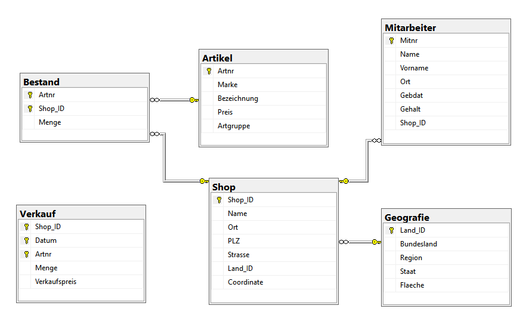

[🏠 zurück zur Startseite](../README.md)

[◀ 2 technische Grundlagen](2_technische_Grundlagen.md)

# 2.1 Datengrundlage

Als fachlicher Ausgangspunkt dient eine relationale Datenbank, die im Rahmen des Mastermoduls *Datenbanktechnologien* (Studiengang Geoinformatik/Management) entwickelt und zu Übungszwecken eingesetzt wurde. Die Verwaltung und Analyse der Daten erfolgte in Microsoft SQL Server Management Studio (MS SSMS).

Die Datenbank umfasst sechs Tabellen, darunter zwei Tabellen mit räumlichen Datentypen (``geography``). Neben klassischen Sachdaten enthält sie somit Punkt- und Flächengeometrien, die für räumliche Abfragen und Berechnungen genutzt werden. Die Tabellen stehen über Primär- und Fremdschlüsselbeziehungen in einem relational konsistenten Zusammenhang.

Die folgende Abbildung zeigt das ER-Diagramm der Referenzdatenbank und verdeutlicht Tabellenstruktur sowie bestehende Beziehungen.

Die relationalen Abfragen, Aggregationen, Views sowie räumlichen Operationen, die im Rahmen der Lehrveranstaltung umgesetzt wurden, definieren den Leistungsumfang, den das Zielsystem reproduzieren soll.

Die strukturelle Integrität (Tabellen, Schlüssel, Relationen) sowie die inhaltliche Konsistenz der Daten stellen dabei zentrale Vergleichskriterien dar. Abweichungen in Schema, Datentypen oder Beziehungen würden die fachliche Gleichwertigkeit der Zielumgebung unmittelbar beeinflussen. Aus diesem Grund dient die hier beschriebene Datenbank nicht lediglich als Datengrundlage, sondern als verbindlicher Bewertungsmaßstab für die spätere Migration, Implementierung und Validierung.

---

[2.2 Anforderungsanalyse ▶](22_Anforderungsanalyse.md)