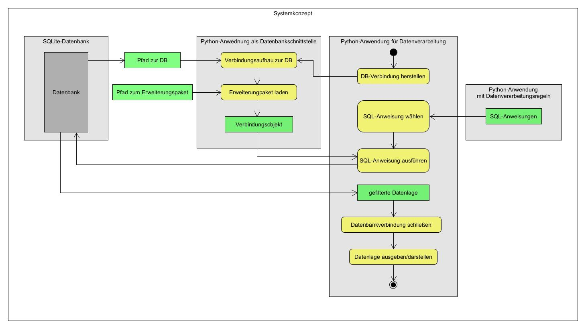

[zurück zur Startseite](../README.md)

# 2.4 Systementwurf

Auf Grundlage der in Abschnitt *2.2 Anforderungsanalyse* definierten Anforderungen wird ein Systementwurf für die Architektur der Zielumgebung entwickelt. Ziel ist es, eine modulare Open-Source-Architektur zu konzipieren, die die zuvor aufgestellten funktionalen und nicht-funktionalen Anforderungen erfüllt.

Der Systementwurf basiert auf einer klaren Trennung zwischen Datenhaltung, Schnittstelle und Verarbeitungslogik. Diese Struktur unterstützt die Wartbarkeit (NP2), die Nachvollziehbarkeit der Implementierung sowie die spätere Validierung einzelner Komponenten.

Die folgende Abbildung zeigt das konzeptionelle Systemmodell und die Interaktionen zwischen den einzelnen Komponenten.

Die Zielarchitektur besteht aus vier zentralen Komponenten:

### 1. Datenhaltung

Die Datenhaltung erfolgt in einer **SQLite-Datenbank** mit aktivierter **SpatiaLite-Erweiterung**.

Sie übernimmt:

- die Speicherung relationaler Sachdaten  
- die Speicherung räumlicher Geometrien  
- die Umsetzung relationaler und räumlicher SQL-Operationen  

Die Struktur der Datenbank orientiert sich am Schema der Referenzdatenbank in Microsoft SQL Server. Ziel ist es, eine strukturelle und inhaltliche Vergleichbarkeit sicherzustellen (ND1–ND3).

### 2. Schnittstelle zur Datenhaltung

Die Schnittstelle wird durch eine Python-basierte Verbindungslogik realisiert.

Ihre Aufgaben umfassen:

- Öffnen der SQLite-Datenbankinstanz  
- Laden der SpatiaLite-Erweiterung  
- Bereitstellung eines wiederverwendbaren Verbindungsobjekts  

Diese Kapselung trennt die Systemkonfiguration von der fachlichen Datenverarbeitung und ermöglicht eine zentrale Verwaltung systemabhängiger Parameter (z. B. Dateipfade).

### 3. Verwaltung der Verarbeitungsregeln

Die SQL-Anweisungen werden zentral verwaltet und in strukturierter Form (Dictionary) abgelegt.

Jede Abfrage besitzt:

- einen eindeutigen Schlüssel  
- eine klar definierte SQL-Definition  

Diese Struktur ermöglicht eine konsistente Wiederverwendung der Abfragen und eine klare Trennung zwischen SQL-Logik und Python-Code.

### 4. Datenverarbeitung und Visualisierung

Die Datenverarbeitung erfolgt durch spezialisierte Python-Skripte.

Diese übernehmen:

- Auswahl der passenden SQL-Anweisung  
- Übergabe der Abfrage an die Datenbank  
- Einlesen der Resultsets in DataFrames  
- Ausgabe tabellarischer Ergebnisse  
- Visualisierung räumlicher Daten mittels GeoPandas und Matplotlib  

Die Trennung zwischen Datenbankzugriff, SQL-Verwaltung und Auswertungsskripten ermöglicht eine modulare Erweiterbarkeit der Lösung. Neue Auswertungen können implementiert werden, ohne die Kernarchitektur verändern zu müssen.

## Zusammenfassung der Architekturprinzipien

Der Systementwurf folgt drei grundlegenden Prinzipien:

1. **Modularität** – Jede Komponente erfüllt eine klar definierte Aufgabe.  
2. **Reproduzierbarkeit** – Die Architektur ist vollständig Open-Source-basiert und portabel.  
3. **Vergleichbarkeit** – Struktur und Funktion orientieren sich am Referenzsystem, um eine systematische Validierung zu ermöglichen.

Der dargestellte Entwurf bildet die konzeptionelle Grundlage für die in [Kapitel 4](4_Implementierung.md) beschriebene Implementierung sowie für die spätere Validierung der funktionalen Gleichwertigkeit.

---

  <a href="22_Anforderungsanalyse.md">◀ 2.3 Anforderungsanalyse</a>
  <a href="3_System_und_Installation.md">3 Systemvoraussetzungen und Softwareinstallation ▶</a>

