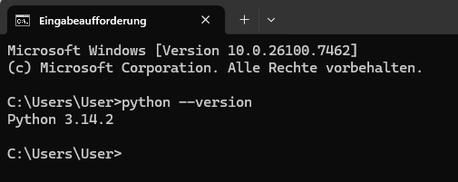
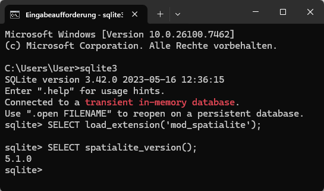

[zurück zur Startseite](../README.md)

# 3.1 Installation der benötigten Softwarekomponenten

Dieses Kapitel beschreibt die grundlegenden Installationsschritte für die im Projekt verwendeten
Softwarekomponenten. Ziel ist es, eine lauffähige Arbeitsumgebung bereitzustellen, in der die
Python-Anwendungen und die SQLite-Datenbank ohne weitere Anpassungen ausgeführt werden
können. Die Anleitung erhebt keinen Anspruch auf Vollständigkeit im Sinne einer detaillierten
Installationsdokumentation der einzelnen Produkte, sondern konzentriert sich auf die für den
Projektbetrieb notwendigen Schritte.


## Installation von Python

Für die Ausführung der Python-Skripte ist eine lokale Python-Installation erforderlich, sofern noch nicht vorhanden.

1. Die aktuelle Python-Version kann von der [offiziellen Projektseite](https://www.python.org/downloads/)  heruntergeladen werden.

2. Während der Installation ist darauf zu achten, dass Python dem Systempfad hinzugefügt wird
   („Add Python to PATH“):
   <br>
   <br>
   
   <br>
3. Der Erfolg der Installation kann über die mit dem Befehel ```python --version``` in der Eingabeaufforderung Überprüft werden. Der Rückgabewert ist die aktuelle Versionsnummer:
   <br>
   <br>
    


###   Installation weiterer Python-Bibliotheken

Das Installieren der benötigten Bibliotheken geschieht mit der Windows Eingabeaufforderung durch das Ausführen des folgenden Befehls:

```console
 pip install pandas geopandas shapely matplotlib
 ```

## Installation von SQLite

SQLite dient als Datenbanksystem für die persistente Speicherung der Projekt­daten. Da SQLite
serverlos arbeitet, ist keine klassische Installation im Sinne eines Datenbankservers
erforderlich.

1. Die vorkompilierten SQLite-Dateien können von der 
   [offiziellen Projektseite](https://www.sqlite.org/download.html) heruntergeladen
   werden. Für Windows wird das Paket *Precompiled Binaries for Windows* benötigt.

2. Das heruntergeladene Archiv wird in ein beliebiges Verzeichnis entpackt, beispielsweise
   `C:\sqlite`.

3. Optional kann das Verzeichnis, dem Systempfad *PATH* hinzugefügt
   werden, um SQLite direkt über die Eingabeaufforderung verwenden zu können.

4. Falls Schritt 3 ausgeführt wurde, kann über die Eingabeaufforderung die Installation mithilfe des folgenden Befehls überprüft werden:

   ```console
   sqlite3 --version
   ```

Wird, wie nach der Installation von Python, eine Versionsnummer ausgegeben, ist SQLite korrekt eingerichtet. Für den Betrieb der
Python-Anwendungen ist der direkte Aufruf von SQLite mithilfe der Eingabeaufforderung nicht zwingend erforderlich, da der
Zugriff auf die Datenbank über das systemeigene Python-Modul sqlite3 erfolgt.

## Installation von SpatiaLite

Zur Verarbeitung räumlicher Daten wird die Erweiterung SpatiaLite benötigt. Diese ergänzt
SQLite um Funktionen zur Speicherung, Analyse und Abfrage von Geodaten.

1. Die passende SpatiaLite-Version für Windows kann von der
[Projektseite](https://www.gaia-gis.it/gaia-sins/) heruntergeladen werden. Es wird die ZIP-Datei names *mod_spatialite* benötigt, welche unter *MS Windows binaries* zu finden ist.

2. Das Archiv wird in ein eigenes Verzeichnis entpackt, beispielsweise
C:\Spatialite.

3. Damit es beim Laden der Erweiterung unter Windows nicht zu möglichen Fehlern kommt, wird empfohlen das neue Verzeichnis dem Systempfad *PATH* hinzuzufügen.

4. Falls Schritt 3 ausgeführt wurde, kann über die Eingabeaufforderung die Installation mithilfe des foglender Befehle überprüft werden:

   4.1. SQLite über folgenden Befehl starten:
   
   ```console 
   sqlite3
   ``` 

   4.2. Laden von SpatiaLite mithilfe der SQL-Anweisung:

   ```sql
   SELECT load_extension('mod_spatialite');
   ```  

   4.3.  SpatiaLite-Version mithilfe folgender SQL-Anweisung ausgeben lassen:

   ```sql
   SELECT spatialite_version();
   ```

   Die Ausgabe kann folgendermaßen aussehen:
   <br>
   <br>
   

   Das SQL-Statement 
   
   ```sql
   SELECT spatialite_version();
   ``` 

   hat die Versionsnummer *5.1.0* zurückgegeben, damit ist die Installation erfolgreich.

## Installation von DB Browser for SQLite

Der Einsatz von **DB Browser for SQLite** ist nicht zwingend erforderlich,
da der Zugriff auf die Datenbank vollständig über Python oder die Eingabeaufforderung erfolgen kann. Das Werkzeug wird jedoch
als unterstützendes Hilfsmittel zur manuellen Inspektion der Datenbank, zur Kontrolle der
Tabellenstruktur sowie zur Ausführung einzelner SQL-Abfragen empfohlen.

DB Browser for SQLite kann von der [offiziellen Projektseite](https://sqlitebrowser.org/) heruntergeladen werden. Es stehen zwei Version zur Verfügung. Zum einen *DB Browser for SQLite - Standard installer* für die Nutzung eines grafischen Installers, wie man es herkommlicherweise von Windows-Anwednungen kennt. Zum anderen *DB Browser for SQLite - . zip (no installer)*, für welche die Installation, wie bei SQLite und SpatiaLite vorgenommen wird.

---
<div style="display: flex; justify-content: space-between;">
  <a href="3_System_und_Installation.md">◀ 3 Systemvoraussetzungen und Softwareinstallation</a>
  <a href="32_Setup.md">3.2 Setup der Projektumgebung
 ▶</a>
</div>