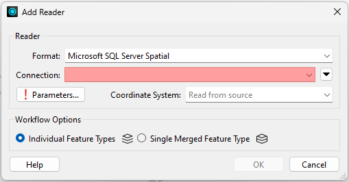
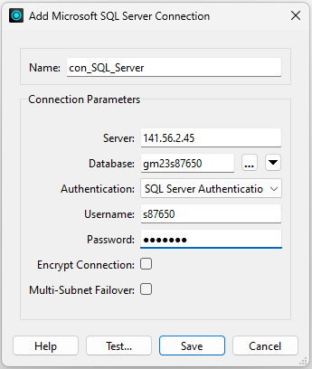
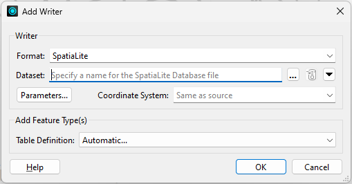
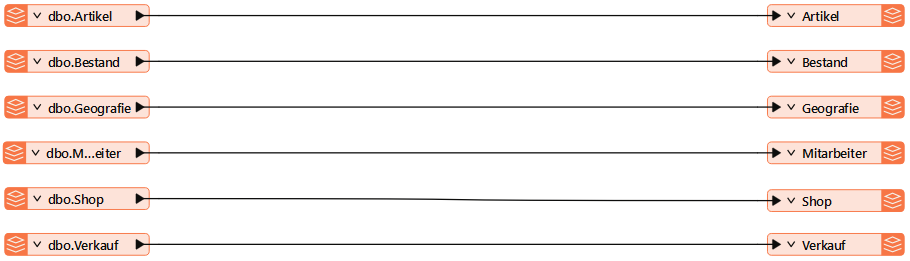
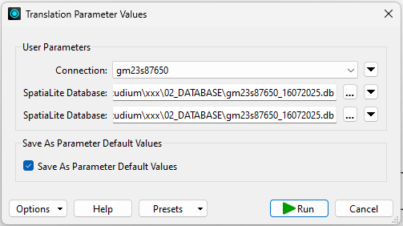

[zurück zur Startseite](../README.md)

# 4.1 Datenbankmigration

Im Rahmen der Implementierung wird die bestehende MS SQL Server-Datenbank in eine SQLite-basierte Umgebung überführt. Ziel der Migration ist es, eine funktional vergleichbare Datenstruktur in SQLite herzustellen, die anschließend als Datengrundlage für die Python-basierte Auswertung genutzt werden kann.

Die Migration erfolgt in zwei Schritten. Zunächst wird das Datenbankschema der ursprünglichen Datenbank in SQLite nachgebildet. Anschließend werden die Tabelleninhalte aus der MS-SQL-Server-Datenbank in die neue SQLite-Datenbank übertragen.

Für diese beiden Schritte werden unterschiedliche Werkzeuge eingesetzt:

- **DB Browser for SQLite** zur Erstellung des Datenbankschemas  
- **Feature Manipulation Engine (FME)** zur Übertragung der Tabelleninhalte

MS SQL Server und SQLite verwenden unterschiedliche SQL-Dialekte, daher ist ein direkter Import des bestehenden Datenbankschemas – beispielsweise über eine SQL-Datei – nicht ohne Weiteres möglich. Aus diesem Grund wird das Schema manuell in SQLite nachgebildet, wobei Tabellenstruktur, Primärschlüssel und Fremdschlüssel der ursprünglichen Datenbank übernommen werden.

Für die Übertragung der Datensätze wird die **Feature Manipulation Engine (FME)** eingesetzt. FME ist ein Werkzeug zur Transformation und Migration von Daten zwischen unterschiedlichen Datenformaten und Datenbanksystemen und wird insbesondere im Umgang mit räumlichen Daten häufig verwendet. Neben der technischen Eignung waren auch die Verfügbarkeit der Software in den Laboreinrichtungen der GI-Fakultät sowie vorhandene Vorkenntnisse im Umgang mit dem FME ausschlaggebend für dessen Einsatz.

## Erstellung des Datenbankschemas mit DB Browser for SQLite

Im DB Browser for SQLite wird zunächst eine neue Datenbank angelegt. Anschließend wird das Datenbankschema durch das Anlegen der Tabellen sowie die Definition von Schlüsselattributen und Constraints aufgebaut. Die Datenbank trägt – analog zu ihrem Gegenstück im MS SQL Server – den Namen *gm23s87650.db*.
Die benötigten SQL-Anweisungen werden im Fenster *SQL ausführen* ausgeführt. Die vollständigen SQL-Statements sind in der Datei `schema_migration.sql` enthalten.
Nach dem Anlegen aller Tabellen liegt eine leere, jedoch strukturell vorbereitete SQLite-Datenbank vor, die im nächsten Schritt mit den Datensätzen der MS SQL Server-Datenbank befüllt wird.

### Unterschiede der Datentypen

Bei der Erstellung des Schemas ist zu beachten, dass sich die Datentypen in SQLite von denen der ursprünglichen MS SQL Server-Datenbank unterscheiden. SQLite verwendet ein dynamisches Typsystem und kennt lediglich fünf grundlegende **Type Affinities**, welche das Speicherverhalten der Werte bestimmen:

- **NULL**
- **INTEGER**
- **REAL**
- **TEXT**
- **BLOB**

Die größere Bandbreite an Datentypen, die Microsoft SQL Server beziehungsweise Transact-SQL bereitstellt, kann daher nicht vollständig abgebildet werden. Beim Erstellen des Datenbankschemas werden die ursprünglichen Datentypen deshalb auf geeignete SQLite-Typen abgebildet.

Die Zuordnung erfolgt im vorliegenden Projekt wie folgt:

- **int** → **INTEGER**
- **money** → **REAL**
- **date** → **TEXT**
- **varchar** → **TEXT**
- **geography** → **BLOB**

Räumliche Daten werden dabei aus der ursprünglichen SQL-Server-Geometriedarstellung in das von SpatiaLite verwendete BLOB-Format überführt. Dieses baut auf dem WKB-Format auf, erweitert dieses jedoch um einen zusätzlichen Header, welcher das jeweilige Objekt mit Metadaten ausstattet.

## Übertragung der Tabelleninhalte mit FME

Die Übertragung der Datensätze aus der MS SQL Server-Datenbank in die SQLite-Datenbank erfolgt mithilfe von FME. Hierzu wird zunächst eine Verbindung zur Referenzdatenbank hergestellt und anschließend eine Verbindung zur zuvor erstellten SQLite-Datenbank konfiguriert.

In FME erfolgt die Datenübertragung über sogenannte **Reader** und **Writer**. Der Reader dient zum Einlesen der Tabellen aus der MS SQL Server-Datenbank, während der Writer die eingelesenen Daten in die Zieldatenbank schreibt.

### Schritt 1: Reader konfigurieren

Zunächst wird in FME ein neuer **Reader** hinzugefügt, der als Datenquelle für die Migration dient.

- Als Datenformat wird **„Microsoft SQL Server Spatial“** ausgewählt.
 
 

 
 
- Anschließend wird im Verbindungsdialog eine Verbindung zur bestehenden MS SQL Server-Datenbank hergestellt.  
- Die hierfür erforderlichen Parameter entsprechen denen, die auch in MS SSMS verwendet werden
 
 

 
 
- Unter *Parameters → Constraints → Tables* werden anschließend die Tabellen ausgewählt, die in die SQLite-Datenbank übertragen werden sollen.

Nach der Bestätigung der Einstellungen erzeugt FME für jede ausgewählte Tabelle ein entsprechendes Reader-Objekt im Arbeitsbereich.

### Schritt 2: Writer konfigurieren

Im nächsten Schritt wird ein **Writer** eingerichtet, der als Ziel der Datenübertragung dient.

- Als Zielformat wird *SpatiaLite* gewählt.
 
 

 
 
- Im Parameter *Dataset* wird der Pfad zur zuvor erstellten Datenbankdatei `gm23s87650.db` angegeben.

Nach der Bestätigung der Einstellungen erscheint für jede Tabelle ein entsprechendes Writer-Objekt im Arbeitsbereich.

### Schritt 3: Reader und Writer verbinden

Anschließend werden die Reader- und Writer-Komponenten miteinander verbunden.

- Jede Reader-Komponente wird mit dem zugehörigen Writer verknüpft.
 
 

 
 

Dadurch erfolgt eine direkte Datenübertragung zwischen Quell- und Zielstruktur.

### Schritt 4: Prozess ausführen

Der eigentliche Migrationsprozess wird anschließend über den **Run-Button** gestartet.

- Während der Ausführung liest FME die Datensätze aus der MS-SQL-Server-Datenbank ein.  
- Die Daten werden anschließend in die SQLite-Datenbank übertragen.
 
 

Nach Abschluss des Prozesses stehen sämtliche Tabelleninhalte in der SQLite-Datenbank zur Verfügung. Diese bildet die Datengrundlage für die im folgenden Abschnitt beschriebene Python-basierte Auswertungsumgebung.

---

  <a href="4_Implementierung.md">◀ 4 Implementierung</a>
  <a href="42_Pythonprogrammierung.md">4.2 Pythonprogrammierung ▶</a>

