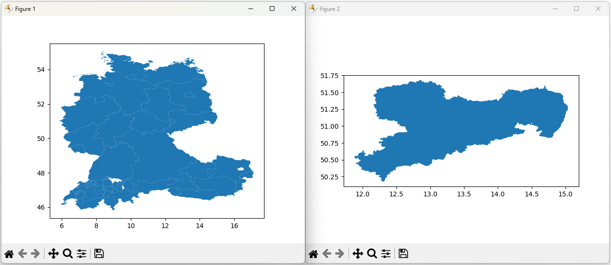

[🏠 zurück zur Startseite](../README.md)

[◀ 4 Implementierung](41_Migration.md)

# 4.2 Python-Programmierung

Wie schon im Kapitel [*2.4 Systementwurf*](24_Systementwurf.md) beschrieben, sind die Python-Anwendungen  modular aufgebaut: Kernfunktionen für den Datenbankzugriff und die Verwaltung der SQL-Anweisungen sind in eigenständigen Modulen gekapselt, während die Datenauswertung als schlanke Skripte implementiert sind, die diese Bausteine lediglich orchestrieren.

## Verbindungslogik zur Datenbank (`dbparam.py`)

Das Modul `dbparam.py` kapselt den Verbindungsaufbau zur SQLite-Datenbank und das Laden der SpatiaLite-Erweiterung. Die Anwendung benötigt dafür die Module `os` und `sqlite3` sowie die Klasse `path` des Moduls `pathlib` und den Dekorator `contextmanager`.

```python
#Import der notwendigen Bibliotheken
import os
import sqlite3
from pathlib import Path
from contextlib import contextmanager
```

Danach folgt die zentrale Definition der Pfade zur Datenbank (`DB_PATH`), dem Verzeichnis, indem die SpatiaLite-Erweiterungsdatei liegt (`SPATIALITE_DIR`) sowie der Pfad zur SpatiaLite-Erweiterungsdatei selbst (`SPATIALITE_DLL`).

```python
#Pfad zu DB-Datei, dem SpatiaLite-Verzeichnis und der SpatiaLite-Erweiterungsdatei
DB_PATH = r"D:\Studium\Studienunterlagen\Master\03_Fachsemester\01_Projektstudium\Projektstudium_Master2024\data\gm23s87650.db"
SPATIALITE_DIR = r"C:\Program Files\Spatialite\mod_spatialite-5.1.0-win-amd64"
SPATIALITE_DLL = r"C:\Program Files\Spatialite\mod_spatialite-5.1.0-win-amd64\mod_spatialite.dll"
```
Durch Aufrufen der Funktion `add_dll_directory()` des Moduls `os` wird das zuvor definierte Verzeichnis der SpatiaLite-Erweiterungsdatei zur Windows-Suchpfadliste hinzugefügt. 

```python
os.add_dll_directory(SPATIALITE_DIR)
```

Dieser Schritt ist notwendig für das spätere Laden der Erweiterung. Dem Betriebssystem wird so mitgeteilt, in welchem Verzeichnis nach DLL-Dateien gesucht werden soll. <br>
Die Verbindung zur Datenbank wird über eine eigens definierte Funktion namens `connection` hergestellt. Diese wird zuvor mit dem Dekorator `@contextmanager` in einen Kontextmanager umgewandelt.

```python
@contextmanager
def connection():

    # Verbindung öffnen
    con = sqlite3.connect(DB_PATH)

    # SpatiaLite-Erweiterung laden
    con.enable_load_extension(True)
    con.load_extension(SPATIALITE_DLL)

    try:
        # Verbindung an den Aufrufer „übergeben“
        yield con
    finally:
        # Verbindung immer schließen – auch bei Fehlern im with-Block
        con.close()
```
Der Vorteil bei der Verwendung eines Kontextmanagers liegt in der Vereinfachung der Syntax. Ohne die Verwendung eines Kontextmanagers gibt die Funktion ``connection()`` lediglich ein Objekt mit einer geöffneten Datenbankverbindung zurück. Nach der Ausführung des entsprechenden SQL-Statements müsste diese wieder manuell geschlossen werden, beispielsweise durch die Nutzung von `con.close()` nach Ausführung des SQL-Statements direkt im Skript für die Datenverarbeitung.

Die Funktion beginnt mit
```python
def connection():
```
und erhält keine Eingabeparameter, da diese ohnehin immer dieselben sind. <br>
Als erster Schritt innerhalb der Funktion `connection()` wird `con` als SQLite-Verbindung definiert. Der entsprechenden Funktion `sqlite3.connect()` wird dafür der Pfad zur Datenbankdatei übergeben. Diese Funktion gibt ein SQLite-Verbindungsobjekt zurück, welches somit in `con` gespeichert ist.
```python
# Verbindung öffnen
    con = sqlite3.connect(DB_PATH)
```
In SQLite ist das Laden von Erweiterungsmodulen standardmäßig deaktiviert. Daher muss SpatiaLite beim Öffnen einer Datenbankverbindung zunächst geladen werden, um SQL-Funktionen für räumliche Abfragen nutzen zu können. Dafür wird die Funktion `enable_load_extension()` auf das Verbindungsobjekt angewendet und der Wert `True` übergeben. Mithilfe der Funktion `load_extension()` wird dann der Pfad zur Erweiterungsdatei (*mod_spatialite.dll*) angegeben.

```python
    # SpatiaLite-Erweiterung laden
    con.enable_load_extension(True)
    con.load_extension(SPATIALITE_DLL)
```
Auf diese Weise ist jede Verbindung, die `connection()` aufbaut fähig, räumliche Funktionen auf die Datenbankinhalte anzuwenden. <br>
Am Ende der Funktion folgt ein `try`-`finally`-Block mit `yield`-Anweisung.
```python
    try:
        # Verbindung an den Aufrufer übergeben
        yield con
    finally:
        # Verbindung immer schließen – auch bei Fehlern im with-Block
        con.close()
```
Dieser Codeabschnitt ist die zentrale Funktionalität des verwendeten Kontextmanagers. Die Funktion `connection()` wird damit in zwei Phasen aufgeteilt:

1. vor-`yield`-Phase
   - Öffnen der Datenbankverbindung
   - Laden der SpatiaLite-Erweiterung
2. nach-`yield`-Phase
   - Schließen der Datenbankverbindung

Der Befehl `yield con` übernimmt zwei Aufgaben gleichzeitig. Er übergibt das Verbindungsobjekt `con` an den Aufrufer (Skripte zur Datenverarbeitung), damit dort unter dessen Angabe SQL-Anweisungen an die Datenbank übermittelt werden können. In den Skripten zur Datenverarbeitung wird das durch einen `with`-Block realisiert:
```python
with connection() as conn:
    df = pd.read_sql(query, conn)
```
Zudem markiert er die Trennlinie zwischen dem Verbindungsaufbau und -abbruch. Der oberhalb von `yield` stehende Code wird beim Eintritt in den `with`-Block ausgeführt, der darunterstehende Code:
```python
    finally:
        # Verbindung immer schließen – auch bei Fehlern im with-Block
        con.close()
```
bei dessen Verlassen. <br>

Die Kombination mit dem `try`-`finally`-Block stellt folgenden Ablauf sicher: Egal, wie der `with`-Block verlassen wird - ob mit oder ohne einem Fehler - der Code im `finally`-Block wird immer ausgeführt. Dadurch wird die Datenbankverbindung, unabhängig vom erfolgreichen Ausführen der SQL-Statements stets geschlossen.

## Verwaltung der SQL-Anweisungen (`queries.py`)

Das Modul `queries.py` dient der zentralen Verwaltung sämtlicher im Projekt verwendeter
SQL-Anweisungen. Alle Abfragen werden in einem Dictionary namens `SQL_QUERIES` hinterlegt, das die
SQL-Statements eindeutig identifizierbar und modular nutzbar macht.

### Struktur des Moduls

`SQL_QUERIES` ist wie folgt aufgebaut:

- **Schlüssel**  
  - kompakt, sprechend und eindeutig  
  - vollständig in **Großbuchstaben**  
  - Worttrennung über **Unterstriche**  

- **Werte**  
  - mehrzeilige SQL-Statements  
  - jeweils vollständig formulierte Abfragen  
  - werden unverändert in den Auswertungsskripten ausgeführt

Zur Veranschaulichung zeigt das folgende Codebeispiel einen Ausschnitt aus dem Anfang des Dictionary mit den SQL-Statements `GEBURTSTAGSKALENDER` und `MITARBEITER_WOHNORT`:

```python
SQL_QUERIES = {
    "GEBURTSTAGSKALENDER": """
        SELECT Name, Gebdat
        FROM Mitarbeiter
        ORDER BY
        CAST(substr(Gebdat, 5, 2) AS INTEGER),
        CAST(substr(Gebdat, 7, 2) AS INTEGER);
    """,

    "MITARBEITER_WOHNORT": """
        SELECT 
            M.Name AS Mitarbeiter, 
            M.Ort AS Wohnort, 
            S.Ort AS Arbeitsort
        FROM Mitarbeiter M
        JOIN Shop S ON M.Shop_ID = S.Shop_ID
        WHERE M.Ort != S.Ort;
    """,

    [...]
```

Die Auswertungsskripte importieren das Dictionary und greifen ausschließlich über den passenden
Schlüssel auf die benötigte Abfrage zu. Dadurch entfällt die Notwendigkeit, SQL-Strings in jedem
Skript separat zu pflegen und sie können bei Bedarf in weiteren Skripten wiederverwendet werden.

### Anpassung der SQL-Statements für SQLite

Die SQL-Anweisungen entsprechen nicht in allen Fällen ihren ursprünglichen Varianten aus der
MS SQL Server-Umgebung. Grund hierfür sind die im vorherigen Kapitel beretis erwähnten Unterschiede in den SQL-Dialekten von MS SQL Server und SQLite. Zum Ausdruck kommt dies im Projektkontext durch abweichende Datentypen und fehlende oder anders benannte SQL-Funktionen. 

Ein exemplarisches Beispiel ist das Statement `GEBURTSTAGSKALENDER`. Das ursprüngliche Transact-SQL-Statement sieht folgendermaßen aus:

```sql
SELECT Name, gebdat
FROM Mitarbeiter
ORDER BY MONTH(gebdat), DAY(gebdat);
```

Dieses musste angepasst werden. Zum einen besitzt das Attribut `gebdat` den Datentyp `date`, welcher in SQLite nicht vorhanden ist. Zum anderen werden für das Erstellen des Geburtstagskalenders der Mitarbeiter die Funktionen `MONTH()` und `DAY()` genutzt, welche in SQLite ebenfalls nicht zur Verfügung stehen. Wie im voherigen Kapitel beschrieben, wird `gebdat` in SQLite als `TEXT` im Format `YYYYMMDD` abgebildet. Da es zudem keine Funktionen wie `DAY()` oder `MONTH()` gibt, müssen Monat und Tag aus dem Text extrahiert werden:

```sql
CAST(substr(GebDat, 5, 2) AS INTEGER) AS Monat,
CAST(substr(GebDat, 7, 2) AS INTEGER) AS Tag
```

Diese Anpassung ermöglicht es, die fachliche Logik der MS SQL Server-Aufgabe trotz genannter Abweichungen beizubehalten.

## Python-Anwendungen für die Sachdatenwiedergabe

Nach der Migration der Datenbank sowie der zentralen Bereitstellung der Verbindungslogik
(`dbparam.py`) und der SQL-Anweisungen (`queries.py`) erfolgt die eigentliche
Datenverarbeitung in entsprechenden Python-Skripten. Diese sind bewusst schlank gehalten und folgen
einem einheitlichen, reproduzierbaren Ablauf.

### Ablaufstruktur der Skripte

Jedes Skript für die tabellarische Ausgabe von Sachdaten besteht im Kern aus vier Schritten:

1. **Auswahl der SQL-Anweisung**  
    über einen Schlüssel aus dem Dictionary `SQL_QUERIES` in `queries.py`.

2. **Aufbau der Datenbankverbindung**  
    über die Funktion `connection()` in `dbparam.py`.

3. **Ausführen der Abfrage und Einlesen der Ergebnisse**  
    über `pandas.read_sql()`, wodurch das Resultset in einen DataFrame überführt wird.

4. **Ausgabe der Ergebnisse**  
    in der Konsole der Entwicklungsumgebung.

### Beispiel: `01_geburtstagskalender.py`

Am Beispiel des Skriptes `01_geburtstagskalender.py` wird der oben genannte Ablauf demonstriert.

Es beginnt mit dem Import des Moduls `pandas`, dem Kontextmanager `connection` as `dbparam.py` und dem Dictionary `SQL_QUERIES` aus `queries.py`.

```python
import pandas as pd
from dbparam import connection
from queries import SQL_QUERIES
```
Es folgt die Auswahl des für die Aufgabe benötigten SQL-Statements über dessen Schlüssel. Dieses wird in der Variable `query` gespeichert.

```python
query = SQL_QUERIES['GEBURTSTAGSKALENDER']
```
Nun folgt der im obigen Abschnitt zu `dbparam.py` bereits erwähnte `with`-Block.

```python
with connection() as conn:
    df = pd.read_sql(query, conn)
```
Dieser interagiert mit dem in `dbparam.py` enthaltenen Kontextmanager zur vollständigen Automatisierung des Öffnens und Schließens der Datenbankverbindung.
Das Verhalten lässt sich in drei voneinander getrennte Phasen einteilen:

**Phase I: Eintritt in den `with`-Block**

Der Eintritt in den `with`-Block geschieht mit der Ausführung folgender Codezeile:

```python
with connection() as conn:
```

In dieser Phase ruft Python `connection()` in `dbparam.py` bis zur `yield`-Anweisung auf.
Dort geschieht folgendes:

1. Die Datenbankverbindung wird hergestellt

```python
    # Verbindung öffnen
    con = sqlite3.connect(DB_PATH)
```

2. Das Laden von Erweiterungen wird aktiviert

```python
    # SpatiaLite-Erweiterung laden
    con.enable_load_extension(True)
```

3. Die SpatiaLite-Erweiterung wird geladen

```python
    con.load_extension(SPATIALITE_DLL)
```

4. Die `yield`-Anweisung übergibt das Verbindungsobjekt `con` an den Aufrufer (`with`-Block)

```python
    try:
        # Verbindung an den Aufrufer „übergeben“
        yield con
```

Das Verbindungsobjekt `con` wird nun als `conn` innerhalb des `with`-Blocks verwaltet, daher die Bezeichnung `as conn` am Ende der Zeile des `with`-Statements. Das Element `conn` beinhaltet nun eine geöffnete SQLite-Datenbankverbindung mit geladener SpatiaLite-Erweiterung.

**Phase II: Ausführung des `with`-Blockinhalts**

Der `with`-Block beinhaltet eine `pandas`-Funktion namens `read_sql()`. Ihr werden das in `query` gespeicherte SQL-Statement sowie das Element `conn` übergeben.

```python
df = pd.read_sql(query, conn)
```

Die Funktion übergibt anhand der Datenbankverbindung das SQL-Statement an die SQLite-Datenbank, liest das gefilterte Ergebnis ein und speichert es in einem `DataFrame` namens `df`.

**Phase III: Verlassen des `with`-Blocks**

Sobald der `with`-Block verlassen wird, führt Python automatisch den Code im `finally`-Zweig des Kontextmangers in `dbparam.py` aus:

```python
finally:
    con.close()
```

Wie schon zuvor erwähnt, spielt es dabei keine Rolle, ob die Ausführung des Inhalts des `with`-Blocks erfolgreich ist. In allen Fällen wird zwingend `con.close()` ausgeführt und die Datenbankverbindung wieder geschlossen.

Schlussendlich wird der `DataFrame` in der Konsole der Entwicklungsumgebung ausgegeben. Dafür werden zwei `print`-Anweisungen genutzt. Die erste dient lediglich einer kurzen Beschreibung der Ausgabe, der zweite gibt schließlich das Ergebnis aus.

```python
#Ausgabe des DataFrames im Terminal (mit vorangestellter Textbeschreibung)
print("\n Die Geburtstage der Mitarbeiter - sortiert nach Monat und Tag:\n")
print(df)
```
Der folgende Auszug zeigt die Struktur des erzeugten `DataFrame`:

```python
 Die Geburtstage der Mitarbeiter - sortiert nach Monat und Tag:

          Name    Gebdat
0         Ralf  19610101
1        Nager  19700110
2   Rubble-Ger  19830115
3   Feuerstein  20010120
4       Tigger  19880125
5         Kind  19930204
6        Kanga  19980213
7    Doolittle  19850219
8         Shir  19680228
9       Grafie  19680310
10  Geröllheim  19820315
11         Eis  20000320
12        Hase  19870325
13     Poppins  19920404
14       Fuchs  19970413
15        Levi  19840419
                    [...]
```

## Python-Anwendungen für Geodatenwiedergabe

Die Programme zur Visualisierung von Geodaten folgen grundlegend dem gleichen Aufbau wie die
Skripte zur Sachdatenwiedergabe. Ergänzt wird dieser Ablauf um die Aufbereitung binärer Geometriedaten
sowie deren Darstellung.

### Ablaufstruktur der Geodaten-Skripte

Die Verarbeitung gliedert sich in klar getrennte Phasen:

1. **Auswahl der SQL-Anweisungen**  
   über Schlüssel aus dem Dictionary `SQL_QUERIES` in `queries.py`.

2. **Aufbau der Datenbankverbindung**  
   über den in `dbparam.py` implementierten Kontextmanager `connection()`.

3. **Einlesen der Abfrageergebnisse**  
   mit `pandas.read_sql()` in DataFrames.

4. **Laden der Geometriedaten**  
   Dekodierung der WKB-Geometrien mit Shapely.

5. **Aufbereiten der DataFrames**  
   Entfernen temporärer Spalten für die Ausgabe.

6. **Erzeugung von GeoDataFrames**  
   aus den DataFrames mithilfe von GeoPandas.

7. **Ausgabe der Daten** <br>
    Ausgabe des GeoDataFrames in der Konsole und Darstellung der Geodaten mit Matplotlib

### Beispiel: `07_geometrien_darstellen.py`

**Anmerkung:** Die zugrundeliegende Aufgabe für dieses Skript (*MS SQL 2 - Aufgabe 9*) verlangt die Darstellung der räumlichen Ergebnisse aller Bundesländer sowie separat für Sachsen. Daher sind zwei SQL-Abfragen integriert und alle Arbeitsschritte werden doppelt ausgeführt.

Da bis zur Arbeitsweise des `with`-Blocks bereits alles im vorhergehenden Abschnitt erläutert wurde, geht dieses Kapitel nur auf die darauffolgenden Schritte ein.

Die Interpretation der Geometriedaten erfordert mehrere Teilschritte. Wie bereits im Kapitel [*4.1 Datenbankmigration*](41_Migration.md) erwähnt liegen die Geometrien in der neuen Datenbank im SpatiaLite-BLOB-Format vor. Die in diesem Skript genutzte Funktion `wkb.loads()` kann dieses jedoch nicht interpretieren und erwartet ein WKB-Format nach OGC-Standard. Daher sind die  zugrundeliegenden SQL-Statements `INHALT_GEOGRAFIE` und `SELECT_SACHSEN` folgendermaßen angepasst (demonstriert am Beispiel `INHALT_GEOGRAFIE`):

```sql
SELECT
    Land_ID,
    Bundesland,
    Region,
    Staat,
    ST_AsBinary(Flaeche) AS Flaeche_WKB
FROM Geografie;
```

Die dort genutzte Funktion `ST_AsBinary()` dekodiert das SpatiaLite-BLOB-Format und speichert es als OGC-Standard-konformes WKB-Format in einer neuen Spalte `Flaeche_WKB`. Diese Spalte **existiert nur im Abfrageergebnis** nicht in der Datenbank. Im Python-Skript wird darauf nun die Shapely-Funktion `wkb.loads()` angewendet.

```python
# Interpretation der Geometriedaten mithilfe von Shapely
df1["Flaeche"] = df1["Flaeche_WKB"].apply(wkb.loads)
df2["Flaeche"] = df2["Flaeche_WKB"].apply(wkb.loads)
```

In den DataFrames wird eine neue Spalte `Flaeche` angelegt. Sie enthält Werte, die durch die Anwendung von ``wkb.loads()`` auf die Werte der Spalte `Flaeche_WKB` erzeugt werden. `Flaeche` ist somit eine reine Shapely-Geometriespalte. 

Da die zugrundeliegende Aufgabe für dieses Skript (*MS SQL 2 - Aufgabe 9*) die Fragestellung *Wie sieht die Definition der Flaeche im WKT-Format aus?* enthält, wird anschließend für eine saubere Ausgabe des DataFrames die Spalte `Flaeche_WKB` entfernt. Bei dessen Darstellung sollen nur *Land_ID*, *Bundesland*, *Region*, *Staat* und *Flaeche* sichtbar sein. Streng genommen handelt es sich bei den Werten in der Spalte `Flaeche` nicht um ein WKT-Format. Doch die Shapely-Geometriewerte werden dem OGC-Format so stark nachempfunden, dass es eine genauso gute Lesbarkeit gewährleistet.

```python
# Entfernen der temporären WKB-Spalte
df1.drop(columns=["Flaeche_WKB"], inplace=True)
df2.drop(columns=["Flaeche_WKB"], inplace=True)
```

Letztendlich erfolgt das Erstellen von GeoDataFrames für die spätere Darstellung der Geometrien. Die Eingabeparameter sind die jeweiligen DataFrames sowie die Spalte `Flaeche`, welche die geographischen Informationen enthält.

```python
# Erstellen von GeoDataFrames
gdf1 = gpd.GeoDataFrame(df1, geometry="Flaeche")
gdf2 = gpd.GeoDataFrame(df2, geometry="Flaeche")
```

Wie bereits aus dem vorherigen Kapitel bekannt, werden die DataFrames in der Konsole ausgegeben.

```python
# Ausgabe der DataFrames im Terminal
print("\nInhalt der Tabelle Geografie:\n")
print(df1)

print("\nInhalt der Tabelle Geografie – Bundesland Sachsen:\n")
print(df2)
```

Das Ergebnis sieht folgendermaßen aus:

```python
Inhalt der Tabelle Geografie:

   Land_ID              Bundesland         Region          Staat                                            Flaeche
0       01                 Sachsen            Ost    Deutschland  MULTIPOLYGON (((12.877999000000102 51.67269900...
1       02                  Bayern            Süd    Deutschland  MULTIPOLYGON (((10.133860000000084 50.54999899...
2       03                Saarland           West    Deutschland  MULTIPOLYGON (((7.037959999999998 49.643380000...
3       04     Nordrhein-Westfalen           West    Deutschland  MULTIPOLYGON (((8.666279000000088 52.525281000...
4       05       Baden-Württemberg            Süd    Deutschland  MULTIPOLYGON (((9.650460000000066 49.776340000...
5       06         Rheinland-Pfalz           West    Deutschland  MULTIPOLYGON (((7.799629000000095 50.943019999...
6       07           Niedersachsen           West    Deutschland  MULTIPOLYGON (((8.48805496452138 53.9254149916...
[...]

Inhalt der Tabelle Geografie – Bundesland Sachsen:

  Land_ID Bundesland Region        Staat                                            Flaeche
0      01    Sachsen    Ost  Deutschland  MULTIPOLYGON (((12.877999000000102 51.67269900...
```


Den letzten Schritt bildet das Darstellen der Geometrien. Zuerst wird die Funktion `plot()` der Matplotlib-Schnittstelle `pyplot` verwendet, um aus den Geometriedaten grafische Objekte zu erzeugen. Anschließend erfolgt mit der Verwendung der `show()`-Funktion die Darstellung der Grafiken.

```python
# Visualisierung der Geodaten
gdf1.plot()
gdf2.plot()
plt.show()
```

Das Ausführen des Skriptes öffnet zwei separate Fenster, in denen die Geometrien der jeweiligen GeoDataFrames dargestellt werden:



**Anmerkung:** Die Laufzeit des Skriptes wird erst mit dem Schließen dieser Fenster beendet.

---
[5 Nutzung der Software auf anderem Desktop ▶](5_Setup_anderer_Desktop.md)