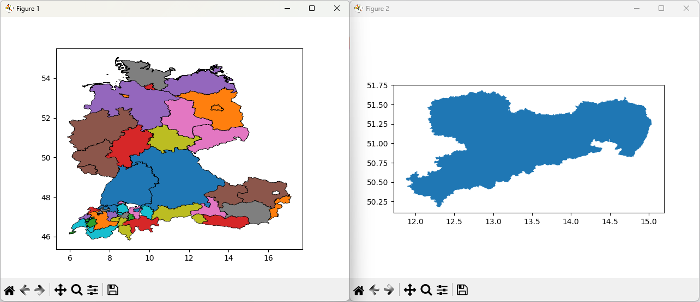

[zurück zur Startseite](../README.md)

# 6.2 Erweiterung der Datenverarbeitung

Zusätzliche Auswertungen oder Visualisierungen können entweder als eigenständige Python-Skripte umgesetzt oder durch Anpassung bestehender Skripte ergänzt werden. Neben der Nutzung der Datenbankabfrage können die eingelesenen Daten mithilfe von pandas auf Anwendungsebene weiterverarbeitet werden. Zur Demonstration wird der durch das Skript `01_geburtstagskalender.py` erzeugte Geburtstagskalender alternativ umgesetzt.

Das Attribut ``Gebdat``, das als Text im Format ``YYYYMMDD`` vorliegt, wird dabei in separate Spalten für Jahr, Monat und Tag zerlegt. Die hierfür benötigten pandas-Operationen werden nach dem `with`-Block auf den eingelesenen DataFrame angewendet.

```python
# Zerlegen des Datumsfeldes (YYYYMMDD) in Jahr, Monat und Tag
df["Jahr"]  = df["Gebdat"].str[0:4].astype(int)
df["Monat"] = df["Gebdat"].str[4:6].astype(int)
df["Tag"]   = df["Gebdat"].str[6:8].astype(int)
```

Der vollständige Code des erweiterten Skripts lautet:

```python
#abgeleitet von MS SQL 1 - Aufbau einer OLTP-Datenbank im MS SQL Server - Aufgabe 8

import pandas as pd
from dbparam import connection
from queries import SQL_QUERIES

query = SQL_QUERIES['GEBURTSTAGSKALENDER']

with connection() as conn:
    df = pd.read_sql(query, conn)

df["Jahr"]  = df["Gebdat"].str[0:4].astype(int)
df["Monat"] = df["Gebdat"].str[4:6].astype(int)
df["Tag"]   = df["Gebdat"].str[6:8].astype(int)

print("\n Die Geburtstage der Mitarbeiter - sortiert nach Monat und Tag: \n")
print(df.to_string(index=False))
```

Auch die kartografische Darstellungsweise der Geodaten kann weiter angepasst werden. Exemplarisch wird dies am Skript ``07_geometrie_darstellen.py`` gezeigt. Die zuvor einheitliche Darstellung der Bundesländer wird erweitert, sodass jede Fläche eine eigene Farbe erhält. Dies erfolgt durch die Nutzung zusätzlicher Parameter der GeoPandas-/Matplotlib-Funktion ``.plot()``.

Zuvor wurde diese ohne die Angabe weiterer Parameter aufgerufen:

```python
# Visualisierung der Geodaten
gdf1.plot()
gdf2.plot()
plt.show()
```

Die neuen Parameter werden einfach der gewünschten `.plot()`-Funktion übergeben:

```python
gdf1.plot(
    column="Bundesland",
    categorical=True,
    edgecolor="black",
    linewidth=0.5
)
gdf2.plot()
plt.show()
```

Die Ausführung des Skripts liefert nun folgendes Ergebnis:



---
<div style="display: flex; justify-content: space-between;">
  <a href="61_Erweiterung_SQL.md">◀ 6.1 Erweiterung der SQL-Verwaltung</a>
  <a href="7_Testen_der_Software.md">7 Testen der Software
 ▶</a>
</div>