[zurück zur Startseite](../README.md#dokumentation)

## Testergebnisse

Nach Abschluss der Migration wird überprüft, ob die Datenbank vollständig und korrekt in
das neue Zielsystem überführt wurde. Diese Prüfung dient der Validierung der strukturellen
Integrität der migrierten Datenbank und entspricht den Testfällen **T01 (Vorhandensein der
Tabellen)** und **T02 (Primärschlüsseldefinitionen)**.

Für die schematische Analyse wird ein ER-Diagramm der SQLite-Datenbank herangezogen. Da SQLite
keine native Funktion zur Generierung von ER-Diagrammen bereitstellt, wird hierfür eine
Drittsoftware eingesetzt. Zum Einsatz kommt die **DBeaver Community Edition**, ein Open-Source-Client
zur Verwaltung verschiedener Datenbanksysteme. Alternativ können auch andere Werkzeuge verwendet
werden, die ER-Diagramme auf Basis einer Datenbankverbindung erzeugen, beispielsweise DBVisualizer.

Die folgende Abbildung zeigt das mithilfe von DBeaver erzeugte ER-Diagramm in der Martin-Notation:

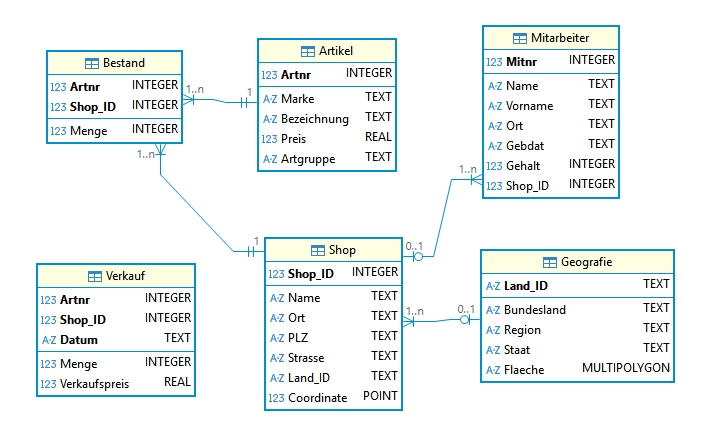

Zusätzlich lassen sich in DBeaver die definierten Constraints einsehen. Durch Auswahl einer
Beziehung im ER-Diagramm werden die beteiligten Attribute sowie deren Kardinalitäten angezeigt.

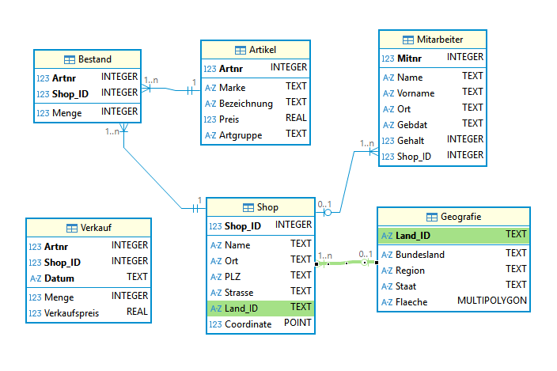

Das ER-Diagramm zeigt, dass das Schema der SQLite-Datenbank – mit Ausnahme der Datentypen –
strukturell identisch zur ursprünglichen Datenbank in Microsoft SQL Server ist. Insbesondere sind
alle Tabellen vorhanden, die Primärschlüssel korrekt definiert und die Fremdschlüsselrelationen
vollständig abgebildet. Damit gelten die Testfälle **T01** und **T02** als erfolgreich
durchgeführt.

### Referenzdaten

Als Referenz dienen die Ergebnisse der im Modul *Datenbanktechnologien* durchgeführten Übungen in
Microsoft SQL Server (MS SSMS). Für jeden Testfall wird eine fachlich äquivalente Abfrage in der
neuen Umgebung (SQLite/SpatiaLite und Python) ausgeführt und mit dem Resultat aus MS SSMS verglichen.

Der Vergleich erfolgt abhängig vom Testtyp über:
- **exakte Übereinstimmung** (z. B. Zeilenzahlen, Join-Ergebnisse, Aggregationen),
- **stichprobenbasierte Übereinstimmung** bei großen Tabellen (z. B. Zufallsstichproben),
- **toleranzbasierte Übereinstimmung** bei räumlichen Berechnungen (z. B. Fläche/Distanz),
  sofern unterschiedliche Rechenmodelle/Einheiten zwischen den Systemen auftreten können.

### Validierung der Tabelleninhalte mittels Aggregat-Signaturen

Die inhaltliche Überprüfung der migrierten Tabellen erfolgt nicht durch manuelle Sichtproben,
sondern ausschließlich über aggregierte Kennzahlen (Aggregat-Signaturen). Dieses Vorgehen ist
insbesondere für große Tabellen geeignet und erlaubt eine reproduzierbare, systematische
Validierung der Datenübertragung.

Die zugrunde liegende Annahme ist, dass beim Migrationsprozess Abweichungen
auf Zeilenebene zwangsläufig zu Veränderungen aggregierter Kennzahlen führen würden. Stimmen
diese Kennzahlen zwischen Referenz- und Zielsystem überein, ist mit hoher Wahrscheinlichkeit von
einer vollständigen und konsistenten Migration auszugehen.

Die Ausgabe der Kennzahlen wird beispielhaft an der Überprüfung der Tabelle *Artikel* vorgenommen. Das folgende SQL-Statement wird zunächst in MS SSMS ausgeführt:

```sql
SELECT
  COUNT(*)                          AS cnt_rows,
  COUNT(DISTINCT Artnr)             AS cnt_distinct_pk,
  MIN(Preis)                        AS min_preis,
  MAX(Preis)                        AS max_preis,
  ROUND(SUM(CAST(Preis AS float)), 2) AS sum_preis,
  SUM(CASE WHEN Marke IS NULL THEN 1 ELSE 0 END)       AS null_marke,
  SUM(CASE WHEN Bezeichnung IS NULL THEN 1 ELSE 0 END) AS null_bezeichnung,
  SUM(CASE WHEN Artgruppe IS NULL THEN 1 ELSE 0 END)   AS null_artgruppe
FROM Artikel;
```

Um die Funktionsweise zu erläutern wird dieses Statement zeilenweise erklärt. Es beginnt mit

```sql
  COUNT(*)                          AS cnt_rows,
```

, welche die Zeilenzahlen der Tabelle wiedergibt. Gefolgt von:

```sql
  COUNT(DISTINCT Artnr)             AS cnt_distinct_pk,
```

, um die eindeutigen Primärschlüsselattribute festzustellen. Stimmen beide ausgegebenen Werte überein ist die Eindeutigkeit des Primärschlüsselattributs gegeben.
Mithilfe der der beiden Zeilen

```sql
  MIN(Preis)                        AS min_preis,
  MAX(Preis)                        AS max_preis,
```

werden der jeweils höchste und niedrigste Wert des Attributes *Preis* ausgegeben, um Ausreißer festzustellen. 

```sql
  SUM(CASE WHEN Marke IS NULL THEN 1 ELSE 0 END)       AS null_marke,
  SUM(CASE WHEN Bezeichnung IS NULL THEN 1 ELSE 0 END) AS null_bezeichnung,
  SUM(CASE WHEN Artgruppe IS NULL THEN 1 ELSE 0 END)   AS null_artgruppe
```

Anschließend wird die Gesamtsumme aller Preise berechnet:

```sql
  ROUND(SUM(CAST(Preis AS float)), 2) AS sum_preis,
```

und letztendlich werden unter Nutzung des CASE-Statements NULL-Werte der Attribute *Marke*, *Bezeichnung* und *Artgruppe* festgestellt. Das Ausführen des gesamten Statements erzeugt folgendes Resultset:

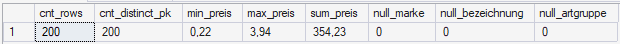

Um Vergleichswerte zu generieren wird das für die Ausgabe genutzte SQL-Statement von T-SQL auf SQLite angepasst:

```sql
SELECT
  COUNT(*) AS cnt_rows,
  COUNT(DISTINCT Artnr) AS cnt_distinct_pk,
  MIN(Preis) AS min_preis,
  MAX(Preis) AS max_preis,
  ROUND(SUM(CAST(Preis AS REAL)), 2) AS sum_preis_r2,
  SUM(CASE WHEN Marke IS NULL THEN 1 ELSE 0 END) AS null_marke,
  SUM(CASE WHEN Bezeichnung IS NULL THEN 1 ELSE 0 END) AS null_bezeichnung,
  SUM(CASE WHEN Artgruppe IS NULL THEN 1 ELSE 0 END) AS null_artgruppe
FROM Artikel;
```

Die Ausführung erfolgt in DB Browser für SQLite und erzeugt folgende Ausgabe:

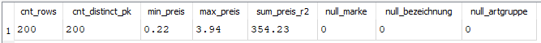

Die aggregierten Kennzahlen in Referenz- und Zielsystem gleichen sich, somit ist mit hoher Wahrscheinlichkeit davon auszugehen, dass die Tabelle vollständig und korrekt übertragen wurde.

### Validierung der Tabelle *Mitarbeiter*

Die Validierung der Tabelle *Mitarbeiter* erfolgt analog zur zuvor beschriebenen
Aggregat-Signatur der Tabelle *Artikel*. Ziel ist es, die Vollständigkeit und
inhaltliche Übereinstimmung der migrierten Personaldaten zwischen der Referenzumgebung
(MS SSMS) und dem Zielsystem (SQLite) zu überprüfen. Die Prüfung adressiert die
Testfälle **T03 (Vollständigkeit der Daten)** sowie **T04 (Integrität des Primärschlüssels)**.

Für die Überprüfung wird in **MS SSMS** folgendes SQL-Statement ausgeführt:

```sql
SELECT
  COUNT(*)                      AS cnt_rows,
  COUNT(DISTINCT Mitnr)         AS cnt_distinct_pk,
  MIN(Gehalt)                   AS min_gehalt,
  MAX(Gehalt)                   AS max_gehalt,
  SUM(CAST(Gehalt AS bigint))   AS sum_gehalt,
  SUM(CASE WHEN Gebdat IS NULL THEN 1 ELSE 0 END) AS null_gebdat,
  SUM(CASE WHEN Shop_ID IS NULL THEN 1 ELSE 0 END) AS null_shopid
FROM Mitarbeiter;
```

Zur Generierung der Vergleichswerte wird in SQLite das äquivalente Statement ausgeführt:

```sql
SELECT
  COUNT(*) AS cnt_rows,
  COUNT(DISTINCT Mitnr) AS cnt_distinct_pk,
  MIN(Gehalt) AS min_gehalt,
  MAX(Gehalt) AS max_gehalt,
  SUM(COALESCE(Gehalt, 0)) AS sum_gehalt,
  SUM(CASE WHEN Gebdat IS NULL THEN 1 ELSE 0 END) AS null_gebdat,
  SUM(CASE WHEN Shop_ID IS NULL THEN 1 ELSE 0 END) AS null_shopid
FROM Mitarbeiter;
```

Der Vergleich enthält neben der Zeilenanzahl und der Anzahl eindeutiger
Primärschlüsselwerte (*Mitnr*) auch Kennzahlen zum Attribut *Gehalt*
(Minimum, Maximum und Summe) sowie die Anzahl von `NULL`-Werten in den
Attributen *Gebdat* und *Shop_ID*. 

Die Anpassungen zwischen beiden SQL-Dialekten betreffen hierbei
ausschließlich die Summenbildung: In MS SSMS wird *Gehalt* explizit auf
`bigint` gecastet, während in SQLite `COALESCE(Gehalt, 0)` verwendet wird,
um mögliche `NULL`-Werte bei der Summation neutral zu behandeln.
 
Die ermittelten Kennzahlen stimmen zwischen MS SSMS und SQLite überein.
Damit ist davon auszugehen, dass die Tabelle *Mitarbeiter* vollständig
und konsistent in das Zielsystem überführt wurde.

| Kennzahl           | MS SSMS     | SQLite     |
|--------------------|-------------|------------|
| `cnt_rows`         | 52 | 52 |
| `cnt_distinct_pk`  | 52 | 52 |
| `min_gehalt`       | 1060 | 1060 |
| `max_gehalt`       | 4310 | 4310 |
| `sum_gehalt`       | 138935 | 138935 |
| `null_gebdat`      | 0 | 0 |
| `null_shopid`      | 0 | 0 |

Die Testfälle **T03** und **T04** gelten für diese Tabelle als erfolgreich durchgeführt.

### Validierung der Tabelle *Bestand*

Die Validierung der Tabelle *Bestand* erfolgt analog zu den zuvor beschriebenen
Aggregat-Signaturen der Tabellen *Artikel* und *Mitarbeiter*. Ziel ist es, die
Vollständigkeit und inhaltliche Konsistenz der Bestandsdaten zwischen der
Referenzumgebung (MS SSMS) und dem Zielsystem (SQLite) zu überprüfen. Die Prüfung
adressiert die Testfälle **T03 (Vollständigkeit der Daten)** sowie **T05
(Integrität zusammengesetzter Primärschlüssel)**.

Die Tabelle *Bestand* besitzt keinen einfachen Primärschlüssel, sondern einen
zusammengesetzten Primärschlüssel bestehend aus den Attributen *Artnr* und
*Shop_ID*. Zur Überprüfung der Eindeutigkeit dieser Schlüsselkombination wird
daher die Anzahl unterschiedlicher Kombinationen aus beiden Attributen ermittelt.

Für die Überprüfung wird in **MS SSMS** folgendes SQL-Statement ausgeführt:

```sql
SELECT
  COUNT(*) AS cnt_rows,
  COUNT(DISTINCT CONCAT(Artnr, '-', Shop_ID)) AS cnt_distinct_pk_combo,
  MIN(Menge) AS min_menge,
  MAX(Menge) AS max_menge,
  SUM(CAST(COALESCE(Menge, 0) AS bigint)) AS sum_menge,
  SUM(CASE WHEN Menge IS NULL THEN 1 ELSE 0 END) AS null_menge
FROM Bestand;
```

Zur Erzeugung der Vergleichswerte wird in SQLite das äquivalente Statement
ausgeführt:


```sql
SELECT
  COUNT(*) AS cnt_rows,
  COUNT(DISTINCT CAST(Artnr AS TEXT) || '-' || CAST(Shop_ID AS TEXT)) AS cnt_distinct_pk_combo,
  MIN(Menge) AS min_menge,
  MAX(Menge) AS max_menge,
  SUM(COALESCE(Menge, 0)) AS sum_menge,
  SUM(CASE WHEN Menge IS NULL THEN 1 ELSE 0 END) AS null_menge
FROM Bestand;
```

Der Vergleich enthält neben der Zeilenanzahl auch die Anzahl eindeutiger
Primärschlüsselkombinationen (*Artnr*, *Shop_ID*), wodurch die Eindeutigkeit des
zusammengesetzten Primärschlüssels überprüft wird. Zusätzlich werden zentrale
Kennzahlen des Attributs *Menge* (Minimum, Maximum und Summe) sowie die Anzahl
möglicher `NULL`-Werte ermittelt.

Die Unterschiede zwischen beiden SQL-Dialekten betreffen ausschließlich die
technische Umsetzung der Schlüsselaggregation und der Summenbildung. In
MS SSMS wird die Schlüsselprüfung über `CONCAT()` realisiert und die Summation
explizit auf `bigint` gecastet, während in SQLite eine Zeichenkettenverkettung
sowie `COALESCE(Menge, 0)` verwendet werden, um `NULL`-Werte neutral zu behandeln.

#### Gegenüberstellung der Kennzahlen

| Kennzahl                    | MS SSMS        | SQLite        |
|-----------------------------|----------------|---------------|
| `cnt_rows`                  | 3800 | 3800 |
| `cnt_distinct_pk_combo`     | 3800  | 3800 |
| `min_menge`                 | 4  | 4 |
| `max_menge`                 | 150  | 150 |
| `sum_menge`                 | 291782  | 291782 |
| `null_menge`                | 0 | 0 |

Die ermittelten Kennzahlen stimmen zwischen MS SSMS und SQLite vollständig
überein. Damit ist davon auszugehen, dass die Tabelle *Bestand* vollständig,
konsistent und ohne Verletzung der zusammengesetzten Primärschlüssel in das
Zielsystem übertragen wurde. Die Testfälle **T03** und **T05** gelten für diese
Tabelle als erfolgreich durchgeführt.

### Validierung der Tabelle *Verkauf*

Die Tabelle *Verkauf* stellt die größte und inhaltlich komplexeste Tabelle der Datenbank dar.
Sie besitzt einen zusammengesetzten Primärschlüssel, bestehend aus den Attributen *Artnr*,
*Shop_ID* und *Datum*. Entsprechend liegt der Fokus der Validierung auf der Überprüfung der
Eindeutigkeit dieser Schlüsselkombination sowie auf der Konsistenz zentraler mengen- und
preisbezogener Kennzahlen. Die Prüfung adressiert die Testfälle **T03 (Vollständigkeit der Daten)**
und **T05 (Integrität zusammengesetzter Primärschlüssel)**.

Für die Referenzumgebung **MS SSMS** wird folgendes SQL-Statement ausgeführt:

```sql
SELECT
  COUNT(*) AS cnt_rows,
  COUNT(DISTINCT CONCAT(Artnr, '-', Shop_ID, '-', CONVERT(varchar(32), Datum, 126))) AS cnt_distinct_pk_combo,
  MIN(Datum) AS min_datum,
  MAX(Datum) AS max_datum,
  MIN(Menge) AS min_menge,
  MAX(Menge) AS max_menge,
  SUM(CAST(COALESCE(Menge, 0) AS bigint)) AS sum_menge,
  ROUND(SUM(CAST(COALESCE(Verkaufspreis, 0) AS float)), 2) AS sum_verkaufspreis_r2,
  ROUND(SUM(CAST(COALESCE(Verkaufspreis, 0) AS float) * CAST(COALESCE(Menge, 0) AS float)), 2) AS sum_umsatz_r2,
  SUM(CASE WHEN Verkaufspreis IS NULL THEN 1 ELSE 0 END) AS null_verkaufspreis,
  SUM(CASE WHEN Menge IS NULL THEN 1 ELSE 0 END) AS null_menge
FROM Verkauf;
```

Zur Ermittlung der Vergleichswerte wird in SQLite das folgende dialektspezifisch angepasste Statement ausgeführt:

```sql
SELECT
  COUNT(*) AS cnt_rows,
  COUNT(DISTINCT CAST(Artnr AS TEXT) || '-' || CAST(Shop_ID AS TEXT) || '-' || CAST(Datum AS TEXT)) AS cnt_distinct_pk_combo,
  MIN(Datum) AS min_datum,
  MAX(Datum) AS max_datum,
  MIN(Menge) AS min_menge,
  MAX(Menge) AS max_menge,
  SUM(COALESCE(Menge, 0)) AS sum_menge,
  ROUND(SUM(COALESCE(Verkaufspreis, 0.0)), 2) AS sum_verkaufspreis_r2,
  ROUND(SUM(COALESCE(Verkaufspreis, 0.0) * COALESCE(Menge, 0)), 2) AS sum_umsatz_r2,
  SUM(CASE WHEN Verkaufspreis IS NULL THEN 1 ELSE 0 END) AS null_verkaufspreis,
  SUM(CASE WHEN Menge IS NULL THEN 1 ELSE 0 END) AS null_menge
FROM Verkauf;
```

Der Vergleich umfasst neben der Gesamtanzahl der Datensätze auch die Anzahl eindeutiger
Primärschlüsselkombinationen (*Artnr*, *Shop_ID*, *Datum*), wodurch die Integrität des
zusammengesetzten Primärschlüssels überprüft wird. Zusätzlich werden zeitliche Randwerte
(*min_datum*, *max_datum*), mengenbezogene Kennzahlen (*min_menge*, *max_menge*, *sum_menge*),
preisbezogene Kennzahlen (*sum_verkaufspreis*) sowie der daraus abgeleitete Gesamtumsatz
(*sum_umsatz*) betrachtet. Ergänzend wird die Anzahl möglicher `NULL`-Werte in den Attributen
*Verkaufspreis* und *Menge* ermittelt.

Die Unterschiede zwischen den SQL-Dialekten betreffen ausschließlich die technische Umsetzung.
In MS SSMS wird die Schlüsselkombination mittels `CONCAT()` und einer expliziten
Datumsumwandlung erzeugt, während SQLite eine Zeichenkettenverkettung mit `CAST()` verwendet.
Bei der Aggregation numerischer Werte werden in beiden Systemen `COALESCE`-Konstrukte genutzt,
um `NULL`-Werte neutral zu behandeln; zusätzlich sind in MS SSMS explizite Typkonvertierungen
auf `bigint` bzw. `float` erforderlich.

#### Gegenüberstellung der Kennzahlen

| Kennzahl                  | MS SSMS        | SQLite        |
|---------------------------|----------------|---------------|
| `cnt_rows`                | 310547  | 310547 |
| `cnt_distinct_pk_combo`   | 310547  | 310547 |
| `min_datum`               | 2023-01-02  | 20230102 |
| `max_datum`               | 2023-04-29  | 20230429 |
| `min_menge`               | 5  | 5 |
| `max_menge`               | 120  | 120 |
| `sum_menge`               | 19450947  | 19450947 |
| `sum_verkaufspreis_r2`    | 640179,17  | 640179,17 |
| `sum_umsatz_r2`           | 40088798,1  | 40088798,1 |
| `null_verkaufspreis`      | 0  | 0 |
| `null_menge`              | 0  | 0 |

Die aggregierten Kennzahlen stimmen zwischen MS SSMS und SQLite vollständig überein. Damit ist
davon auszugehen, dass die Tabelle *Verkauf* vollständig, konsistent und ohne Verletzung des
zusammengesetzten Primärschlüssels in das Zielsystem übertragen wurde. Die Testfälle **T03**
und **T05** gelten für diese Tabelle als erfolgreich durchgeführt.

### Validierung der Tabelle Geografie

Die Validierung der Tabelle *Geografie* erfolgt getrennt von der Implementierung und dient der
Überprüfung, ob die räumlichen und attributiven Inhalte der Tabelle vollständig und konsistent
von der Referenzdatenbank in Microsoft SQL Server nach SQLite/SpatiaLite übertragen wurden.
Da es sich um eine Geodatentabelle handelt, kombiniert die Prüfung quantitative Kennzahlen mit
einer räumlichen Plausibilitätskontrolle.

#### Quantitative Validierung mittels Kennzahlen

Zunächst werden aggregierte Kennzahlen ermittelt, um die Vollständigkeit der Tabelle sowie die
Konsistenz der Schlüssel- und Attributwerte zu überprüfen. Dazu wird in beiden Systemen ein
äquivalentes SQL-Statement ausgeführt.

**MS SSMS:**

```sql
SELECT
  COUNT(*) AS cnt_rows,
  COUNT(DISTINCT Land_ID) AS cnt_distinct_pk,
  SUM(CASE WHEN Flaeche IS NULL THEN 1 ELSE 0 END) AS null_geom,
  COUNT(DISTINCT Staat) AS cnt_staat,
  COUNT(DISTINCT Bundesland) AS cnt_bundesland
FROM Geografie;
```

**SQLite:**

```sql
SELECT
  COUNT(*) AS cnt_rows,
  COUNT(DISTINCT Land_ID) AS cnt_distinct_pk,
  SUM(CASE WHEN Flaeche IS NULL THEN 1 ELSE 0 END) AS null_geom,
  COUNT(DISTINCT Staat) AS cnt_staat,
  COUNT(DISTINCT Bundesland) AS cnt_bundesland
FROM Geografie;
```

Der Vergleich umfasst neben der Gesamtanzahl der Datensätze auch die Anzahl eindeutiger
Primärschlüsselwerte (*Land_ID*), wodurch die Eindeutigkeit des Primärschlüssels überprüft wird.
Zusätzlich wird die Anzahl von Datensätzen ohne zugeordnete Geometrie ermittelt.

Dabei ist zu berücksichtigen, dass in der Tabelle *Geografie* ein Datensatz bewusst ohne
Geometrie hinterlegt ist. Entscheidend ist daher, dass die Anzahl der `NULL`-Geometrien zwischen
Referenz- und Zielsystem übereinstimmt.

Die Anzahl unterschiedlicher Werte in den Attributen *Staat* und *Bundesland* dient als
Plausibilitätskennzahl für die fachliche Struktur der Tabelle.

| Kennzahl          | MS SSMS        | SQLite        |
|-------------------|----------------|---------------|
| `cnt_rows`        | 47  | 47 |
| `cnt_distinct_pk` | 47  | 47 |
| `null_geom`       | 1              | 1             |
| `cnt_staat`       | 4  | 4 |
| `cnt_bundesland`  | 47  | 47 |

Die aggregierten Kennzahlen stimmen zwischen MS SSMS und SQLite vollständig überein. Insbesondere
wird der erwartete Datensatz ohne Geometrie in beiden Systemen identisch abgebildet. Damit ist
davon auszugehen, dass die Tabelle *Geografie* vollständig und korrekt übertragen wurde.
Die Testfälle **T01**, **T03** und **T11** gelten damit für diese Tabelle als erfolgreich
durchgeführt.

#### Räumliche Plausibilitätsprüfung

Ergänzend zur quantitativen Analyse wird eine visuelle Prüfung der Geometrien vorgenommen. Dazu
wird die Tabelle *Geografie* in einer GIS-Umgebung (QGIS) geladen. Ziel dieser Prüfung ist es, sicherzustellen, dass die
vorhandenen Geometrien fachlich plausibel sind, korrekt positioniert vorliegen und keine
offensichtlichen räumlichen Artefakte (z. B. verschobene, invertierte oder degenerierte Flächen)
enthalten.

Im QGIS wird zunächst eine Verbindung zur SQLite-Datenbank hergestellt.

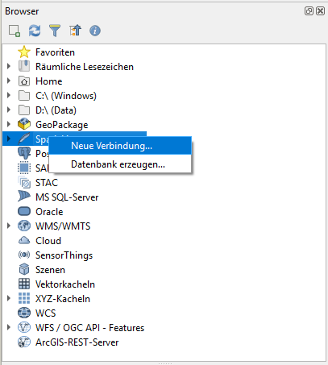

Die entsprechende Tabelle wird anschließend aus der Baumstruktur mittels eines Doppelklicks als Layer hinzugefügt.

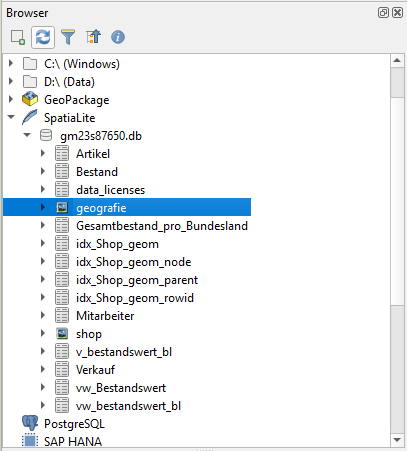

Zur Überprüfung der Lagegenauigkeit wird OpenStreetMap als Grundkarte hinzugefügt. Die untenstehende Abbildung zeigt die dargestellten Geometrien.

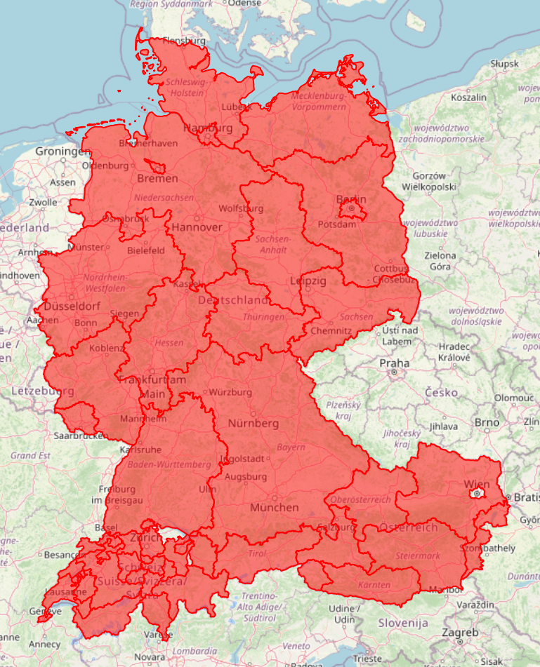

Die visuelle Kontrolle bestätigt, dass alle vorhandenen Flächengeometrien korrekt dargestellt
werden und die räumliche Lage der Bundesländer den fachlichen Erwartungen entspricht. Der
Datensatz ohne Geometrie wird erwartungsgemäß nicht visualisiert.

### Validierung der Tabelle Shop

Die Validierung der Tabelle *Shop* dient der Überprüfung, ob die attributiven Inhalte sowie die
punktförmigen Geometrien der Shops vollständig und konsistent von der Referenzdatenbank in
Microsoft SQL Server nach SQLite/SpatiaLite übertragen wurden. Analog zur Tabelle *Geografie*
erfolgt die Prüfung durch eine Kombination aus quantitativer Kennzahlenanalyse und räumlicher
Plausibilitätskontrolle.

#### Quantitative Validierung mittels Kennzahlen

Zunächst werden aggregierte Kennzahlen herangezogen, um die Vollständigkeit der Tabelle, die
Eindeutigkeit des Primärschlüssels sowie die Konsistenz der relevanten Attribute zu überprüfen.
Hierfür werden in beiden Systemen äquivalente SQL-Statements ausgeführt.

**MS SSMS:**

```sql
SELECT
  COUNT(*) AS cnt_rows,
  COUNT(DISTINCT Shop_ID) AS cnt_distinct_pk,
  SUM(CASE WHEN Coordinate IS NULL THEN 1 ELSE 0 END) AS null_geom,
  COUNT(DISTINCT Land_ID) AS cnt_land,
  COUNT(DISTINCT Ort) AS cnt_ort
FROM Shop;
```

```sql
SELECT
  COUNT(*) AS cnt_rows,
  COUNT(DISTINCT Shop_ID) AS cnt_distinct_pk,
  SUM(CASE WHEN Coordinate IS NULL THEN 1 ELSE 0 END) AS null_geom,
  COUNT(DISTINCT Land_ID) AS cnt_land,
  COUNT(DISTINCT Ort) AS cnt_ort
FROM Shop;
```

Der Vergleich umfasst die Gesamtanzahl der Datensätze sowie die Anzahl eindeutiger
Primärschlüsselwerte (Shop_ID), womit die Eindeutigkeit des Primärschlüssels überprüft wird.
Darüber hinaus wird die Anzahl von Datensätzen ohne zugeordnete Punktgeometrie ermittelt.
Da jeder Shop fachlich eindeutig lokalisiert sein muss, wird erwartet, dass keine
NULL-Geometrien vorliegen.


| Kennzahl          | MS SSMS | SQLite |
|-------------------|---------|--------|
| `cnt_rows`        | 21      | 21     |
| `cnt_distinct_pk` | 21      | 21     |
| `null_geom`       | 0       | 0      |
| `cnt_land`        | 11 | 11 |
| `cnt_ort`         | 20 | 20 |

Die ermittelten Kennzahlen stimmen zwischen MS SSMS und SQLite vollständig überein. Damit ist davon auszugehen, dass die Tabelle Shop vollständig und konsistent in das Zielsystem
übertragen wurde. Die Testfälle T01, T03 und T11 gelten für diese Tabelle als
erfolgreich durchgeführt.

#### Räumliche Plausibilitätsprüfung

Ergänzend zur quantitativen Analyse wird eine visuelle Prüfung der Punktgeometrien vorgenommen.
Hierfür wird die Tabelle *Shop* in derselben GIS-Umgebung geladen, die bereits für die Validierung
der Tabelle *Geografie* verwendet wurde. Die Shops werden gemeinsam mit den Flächengeometrien der
Bundesländer dargestellt, um ihre räumliche Lage fachlich einordnen zu können.

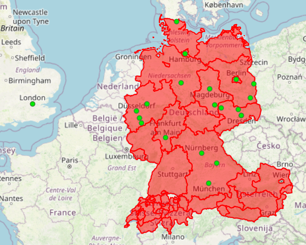

Die visuelle Kontrolle zeigt, dass alle Shops innerhalb der erwarteten Bundesländer liegen und
keine offensichtlichen räumlichen Auffälligkeiten wie stark verschobene oder falsch zugeordnete
Punkte auftreten. Damit ist auch die räumliche Plausibilität der Tabelle *Shop* gegeben.

### Validierung der Sachdatenabfragen

#### T07 – Sortierte Sachdatenabfrage (Geburtstagskalender)

Ziel dieses Testfalls ist die Validierung einer fachlich äquivalenten,
sortierten Sachdatenabfrage zwischen der Referenzumgebung
(Microsoft SQL Server, MS SSMS) und der Zielumgebung (SQLite in Kombination
mit Python). Am Beispiel des Geburtstagskalenders wird überprüft, ob das
System in der Lage ist, Datensätze korrekt auszugeben und anhand definierter
Attribute deterministisch zu sortieren.

Der Testfall adressiert die funktionalen Anforderungen **FP3 (Ausführung von
SQL-Anweisungen)** sowie **FP5 (tabellarische Ausgabe von Sachdaten)**.

Verglichen werden die Resultsets beider Systeme mit dem Ziel, sicherzustellen,
dass die Abfrage in beiden Umgebungen identische Datensätze in identischer,
durch die SQL-Abfrage vorgegebener Sortierreihenfolge liefert.

Für den Vergleich gelten folgende Kriterien:

- identische Anzahl der Ergebniszeilen,
- identische Datensätze,
- identische Sortierreihenfolge gemäß der in der Abfrage definierten
  `ORDER BY`-Klausel,
- Übereinstimmung der Attributwerte `Name` und `Gebdat` je Datensatz.

Zur Durchführung des Testfalls wird in der Referenzumgebung Microsoft SQL Server
Management Studio (MS SSMS) die entsprechende Referenzabfrage ausgeführt und das
Resultset ausgegeben. Anschließend wird in der Zielumgebung SQLite das fachlich
äquivalente SQL-Statement über das Python-Skript
`01_geburtstagskalender.py` ausgeführt. Die erzeugten Ergebnislisten werden
einander gegenübergestellt und anhand der definierten Vergleichskriterien
überprüft.

Aufgrund der Größe der Ergebnismenge wird auf eine vollständige visuelle
Darstellung des Resultsets in der Projektdokumentation verzichtet und die
Darstellung auf eine repräsentative Teilausgabe (erste 15 Zeilen) begrenzt.

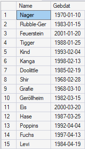

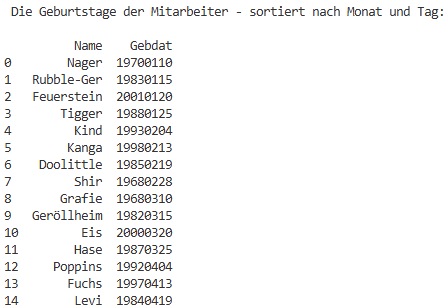

Die Resultsets beider Systeme weisen identische Datensätze sowie eine vollständig
übereinstimmende Sortierreihenfolge auf.

Damit ist nachgewiesen, dass die Zielumgebung SQLite sortierte
Sachdatenabfragen fachlich korrekt und reproduzierbar ausführen kann.

#### T08 – Join Mitarbeiter–Shop

Ziel dieses Testfalls ist die Validierung einer fachlich äquivalenten
Join-Abfrage zwischen der Referenzumgebung (Microsoft SQL Server, MS SSMS)
und der Zielumgebung (SQLite in Kombination mit Python). Untersucht wird,
ob das System in der Lage ist, relationale Verknüpfungen zwischen mehreren
Tabellen korrekt auszuführen und gefilterte Sachdaten reproduzierbar
auszugeben.

Der Testfall adressiert die funktionalen Anforderungen **FP3 (Ausführung von
SQL-Anweisungen)** sowie **FP4 (Einlesen gefilterter Datenlagen)**.

Bei der zugrunde liegenden Abfrage handelt es sich um einen **INNER JOIN**
zwischen den Tabellen `Mitarbeiter` und `Shop` über das gemeinsame
Schlüsselattribut `Shop_ID`. Zusätzlich wird eine Filterbedingung angewendet,
die ausschließlich jene Datensätze berücksichtigt, bei denen der Wohnort eines
Mitarbeiters vom zugehörigen Arbeitsort abweicht. Diese Abfrage entspricht der
Lösung der Aufgabe 8 aus der Übung *MS SQL 1 – Aufbau einer OLTP-Datenbank im
MS SQL Server* und wird als fachliche Referenz herangezogen.

Verglichen werden die Resultsets beider Systeme mit dem Ziel, sicherzustellen,
dass die Join-Operation und die Filterlogik in beiden Umgebungen identische
Ergebnisse liefern.

Für den Vergleich gelten folgende Kriterien:

- identische Anzahl der Ergebniszeilen,
- identische Kombinationen der Attribute `Mitarbeiter`, `Wohnort` und
  `Arbeitsort`,
- Übereinstimmung der ausgegebenen Attributwerte je Datensatz.

Zur Durchführung des Testfalls wird in der Referenzumgebung Microsoft SQL Server
Management Studio (MS SSMS) die entsprechende Join-Abfrage ausgeführt und das
Resultset ausgegeben. Anschließend wird in der Zielumgebung SQLite das fachlich
äquivalente SQL-Statement über das Python-Auswertungsskript
`02_mitarbeiter_wohnort.py` ausgeführt. Dieses dient der Übergabe der
SQL-Anweisung an die Datenbank sowie der tabellarischen Ausgabe der Ergebnisse.

Aufgrund der Größe der Ergebnismenge wird auf eine vollständige visuelle
Darstellung des Resultsets in der Projektdokumentation verzichtet. Stattdessen
wird eine repräsentative Teilausgabe herangezogen. Die vollständige
Ergebnismenge ist durch erneute Ausführung der Abfragen in beiden Systemen
reproduzierbar.

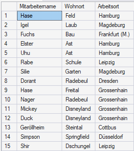

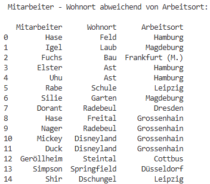

Die Resultsets beider Systeme weisen identische Datensätze sowie übereinstimmende
Zuordnungen zwischen Mitarbeitern und Arbeitsorten auf. Die angewendete
Filterbedingung liefert in beiden Umgebungen konsistente Ergebnisse; Abweichungen
in der Verknüpfung der Datensätze konnten nicht festgestellt werden.

Damit ist nachgewiesen, dass die Zielumgebung SQLite relationale
JOIN-Operationen und Filterbedingungen fachlich korrekt ausführen kann. Der
Testfall bildet zugleich die Grundlage für den nachfolgenden Testfall
**T09 (Aggregation / View)**, in dem aufbauend auf korrekt verknüpften
Datensätzen Aggregatfunktionen überprüft werden.

#### T09 – Aggregation von Sachdaten (Gruppierung)

Ziel dieses Testfalls ist die Validierung einer fachlich äquivalenten
Aggregationsabfrage zwischen der Referenzumgebung (Microsoft SQL Server, MS SSMS)
und der Zielumgebung (SQLite in Kombination mit Python). Untersucht wird, ob das
System in der Lage ist, Aggregatfunktionen und Gruppierungen auf korrekt
verknüpften Datensätzen auszuführen und aggregierte Sachdaten reproduzierbar
bereitzustellen.

Der Testfall adressiert die funktionalen Anforderungen **FD4 (Aggregation und
Views)** sowie **FP3 (Ausführung von SQL-Anweisungen)** und **FP5 (tabellarische
Ausgabe aggregierter Sachdaten)**.

Als fachliche Referenz dient die Lösung der dritten Teilaufgabe von Aufgabe 8
des Moduls *Datenbanktechnologien* (*MS SQL 1 – Aufbau einer OLTP-Datenbank im
MS SQL Server*). In dieser Teilaufgabe wird der wertmäßige Gesamtbestand aller
Waren je Bundesland ermittelt. Die Berechnung erfolgt mittels einer
Aggregationsfunktion (Summe aus Menge und Preis) und wird in der
Referenzumgebung explizit in Form eines Views umgesetzt. Diese Referenz bildet
den Maßstab für die Validierung der Aggregations- und Gruppierungslogik in der
Zielumgebung SQLite.

Verglichen werden die Resultsets beider Systeme mit dem Ziel, sicherzustellen,
dass die Aggregationslogik in beiden Umgebungen identische Gruppierungsergebnisse
und übereinstimmende aggregierte Werte liefert.

Für den Vergleich gelten folgende Kriterien:

- identische Anzahl der Aggregationsergebnisse,
- identische Gruppierungsschlüssel (Bundesländer),
- Übereinstimmung der berechneten Aggregatwerte je Gruppe.

Zur Durchführung des Testfalls wird in der Referenzumgebung Microsoft SQL Server
Management Studio (MS SSMS) der zuvor angelegte View abgefragt, welcher die
aggregierten Bestandswerte je Bundesland bereitstellt. In der Zielumgebung
SQLite wird die fachlich äquivalente Aggregationsabfrage über ein
Python-Auswertungsskript ausgeführt, das die SQL-Anweisung an die Datenbank
übermittelt und die Ergebnisse tabellarisch ausgibt.

Die in beiden Systemen erzeugten Ergebnislisten werden einander
gegenübergestellt und anhand der definierten Vergleichskriterien überprüft. Da
Aggregationsabfragen im Vergleich zu vollständigen Tabellen eine reduzierte
Ergebnismenge liefern, ist eine visuelle Gegenüberstellung der Resultsets
möglich und ausreichend.

Die Reihenfolge der ausgegebenen Gruppierungsergebnisse ist ohne explizite
`ORDER BY`-Klausel nicht deterministisch und stellt daher kein
Vergleichskriterium dar. Der Vergleich erfolgt mengenbasiert anhand der Paare
(Bundesland, aggregierter Bestandswert).

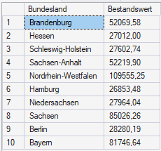

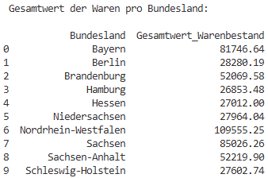

Die Resultsets beider Systeme weisen identische Gruppierungsschlüssel sowie
übereinstimmende Werte der berechneten Aggregatfunktionen auf. Abweichungen in
der Anzahl der Gruppen oder in den berechneten Bestandswerten konnten nicht
festgestellt werden.

Damit ist nachgewiesen, dass die Zielumgebung SQLite Aggregatfunktionen,
Gruppierungen und die Bereitstellung aggregierter Sachdaten fachlich korrekt
ausführen kann. Der Testfall baut auf den zuvor validierten
JOIN-Operationen aus **T08** auf und schließt die Prüfung der zentralen
Sachdatenfunktionen ab.

#### T10 – Darstellung von Flächengeometrien

Ziel dieses Testfalls ist die Überprüfung, ob die Zielumgebung (SQLite in
Kombination mit SpatiaLite und Python) in der Lage ist, gespeicherte
Flächengeometrien korrekt auszulesen, zu interpretieren und visuell darzustellen.
Der Testfall dient dem Nachweis einer grundlegenden räumlichen Kernfunktionalität
und bildet die Voraussetzung für nachfolgende räumliche Abfragen und
Berechnungen.

Der Testfall adressiert die funktionalen Anforderungen **FD1 (Speicherung von
Geometrien in einer SpatiaLite-Datenbank)** sowie **FP6 (Visualisierung
räumlicher Daten)**.

Grundlage des Testfalls ist das Python-Skript `07_geometrie_darstellen.py`, das
zur Überprüfung der Fähigkeit eingesetzt wird, Flächengeometrien aus der
Datenbank auszulesen, in ein geeignetes Geometrieformat zu überführen und
visuell darzustellen.

Die im Skript verwendeten SQL-Abfragen liefern neben attributiven Informationen
die Flächengeometrien im Well-Known-Binary-Format (WKB). Die Geometrien werden im
Anschluss im Arbeitsspeicher mithilfe der Bibliothek *Shapely* interpretiert und
in GeoDataFrames überführt.

Zur Visualisierung werden die erzeugten GeoDataFrames in einer Kartenansicht
dargestellt. Ziel ist es zu überprüfen, ob die Geometrien vollständig gelesen,
korrekt interpretiert und ohne Laufzeitfehler visualisiert werden können.

Für den Test gelten folgende Kriterien:

- das Python-Skript wird ohne Fehler ausgeführt,
- die Geometrien können aus dem WKB-Format korrekt rekonstruiert werden,
- die Visualisierung der Flächengeometrien erfolgt ohne Laufzeitfehler

Durch Ausführung der Anwendung wird folgendes Ergebnis erzeugt:


Die erfolgreiche Ausführung des Skripts und die korrekte Darstellung der
Flächengeometrien zeigen, dass die Zielumgebung räumliche Geometrien korrekt
verarbeiten und visualisieren kann.

Damit ist nachgewiesen, dass die grundlegende Verarbeitung und Darstellung
räumlicher Daten in der Zielumgebung möglich ist.

#### T11 – Räumliche Selektion: Punkt-in-Polygon

Ziel dieses Testfalls ist die Überprüfung, ob die Zielumgebung (SQLite in
Kombination mit SpatiaLite und Python) in der Lage ist, räumliche Prädikate
korrekt anzuwenden. Konkret wird untersucht, ob Punktgeometrien (Shops) anhand
einer Flächengeometrie (Bundesland) räumlich selektiert werden können
(Punkt-in-Polygon-Abfrage).

Der Testfall adressiert die funktionalen Anforderungen **FD2 (Räumliche
Abfragen)** sowie **FP3 (Ausführung von SQL-Anweisungen)**.

Aufbauend auf dem Testfall **T10**, in dem nachgewiesen wurde, dass
Flächengeometrien korrekt aus der Datenbank gelesen und dargestellt werden
können, wird in diesem Testfall erstmals eine räumliche Funktion angewendet.
Dabei wird geprüft, ob die räumliche Beziehung zwischen Punkt- und
Flächengeometrien fachlich korrekt ausgewertet wird.

Als fachliche Referenz dient eine räumliche Abfrage in der Referenzumgebung
Microsoft SQL Server (MS SSMS), bei der alle Shops ermittelt werden, deren
Punktgeometrie innerhalb der Fläche eines ausgewählten Bundeslands liegt. In
der Zielumgebung wird eine fachlich äquivalente Abfrage mithilfe der
SpatiaLite-Funktionen ausgeführt.

Verglichen werden die Resultsets beider Systeme mit dem Ziel, sicherzustellen,
dass die räumliche Selektion identische Shops liefert.

Für den Vergleich gelten folgende Kriterien:

- identische Anzahl der selektierten Shops,
- identische Menge der ermittelten `Shop_ID`,
- Übereinstimmung der zugehörigen attributiven Informationen je Datensatz.

Zur Durchführung des Testfalls wird in beiden Systemen eine räumliche
Punkt-in-Polygon-Abfrage ausgeführt. In der Zielumgebung erfolgt die Ausführung
über ein Python-Skript, welches die SQL-Anweisung an die Datenbank übermittelt
und die Ergebnisse tabellarisch ausgibt.

Da die Reihenfolge der Ergebniszeilen ohne explizite `ORDER BY`-Klausel nicht
deterministisch ist, stellt sie kein Vergleichskriterium dar. Der Vergleich
erfolgt mengenbasiert anhand der ermittelten `Shop_ID`.

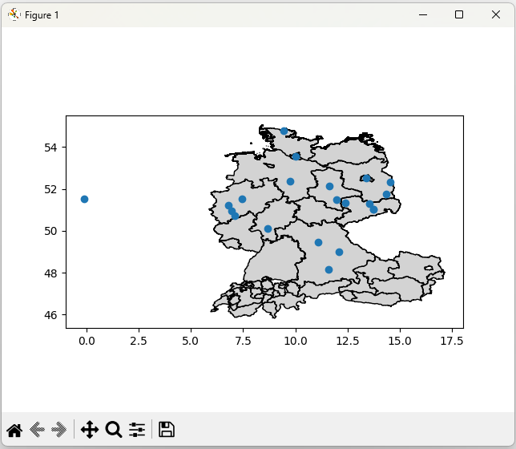

Die Resultsets beider Systeme liefern identische Mengen an Shops innerhalb des
ausgewählten Bundeslands. Abweichungen in der Anzahl oder in der Zuordnung der
Shops konnten nicht festgestellt werden.

Damit ist nachgewiesen, dass die Zielumgebung SQLite/SpatiaLite räumliche
Punkt-in-Polygon-Abfragen fachlich korrekt ausführen kann.

Der Testfall **T11 – Räumliche Selektion: Punkt-in-Polygon** gilt somit als
erfolgreich durchgeführt.

#### T12 – Räumliche Berechnung: Flächenberechnung von Bundesländern

Ziel dieses Testfalls ist die Überprüfung, ob die Zielumgebung (SQLite in
Kombination mit SpatiaLite und Python) in der Lage ist, räumliche Berechnungen
auf Flächengeometrien korrekt durchzuführen. Konkret wird untersucht, ob die
Flächen der Bundesländer auf Basis ihrer Polygongeometrien berechnet werden
können und fachlich plausible sowie mit der Referenzumgebung vergleichbare
Ergebnisse liefern.

Der Testfall adressiert die funktionalen Anforderungen **FD3 (Räumliche
Berechnungen)** sowie **FP3 (Ausführung von SQL-Anweisungen)**.

Aufbauend auf den vorangegangenen Testfällen **T10**, in denen die korrekte
Verarbeitung und Darstellung von Flächengeometrien nachgewiesen wurde, sowie
**T11**, in denen räumliche Beziehungen zwischen Punkt- und Flächengeometrien
überprüft wurden, wird in diesem Testfall erstmals eine metrische räumliche
Berechnung durchgeführt.

Als fachliche Referenz dient die Flächenberechnung in der Referenzumgebung
Microsoft SQL Server (MS SSMS), bei der die Flächen der Bundesländer auf Basis
der gespeicherten Geometrien berechnet werden. In der Zielumgebung erfolgt die
fachlich äquivalente Berechnung mithilfe von SpatiaLite-Funktionen, wobei die
Ergebnisse über ein Python-Skript tabellarisch ausgegeben werden.

Verglichen werden die Resultsets beider Systeme mit dem Ziel, sicherzustellen,
dass die berechneten Flächenwerte fachlich übereinstimmen.

Für den Vergleich gelten folgende Kriterien:

- identische Anzahl der berechneten Flächenwerte,
- eindeutige Zuordnung der berechneten Flächen zu identischen Bundesländern,
- Übereinstimmung der berechneten Flächenwerte innerhalb einer definierten
  relativen Toleranz.

Die Notwendigkeit des Festlegens einer relativen Toleranz ergibt sich aus geringfügigen numerischen Abweichungen bei Flächenberechnungen in unterschiedlichen räumlichen Datenbanksystemen. Ein Flächenwert gilt als übereinstimmend, wenn die relative Abweichung den
Toleranzwert von **0,5 %** nicht überschreitet.

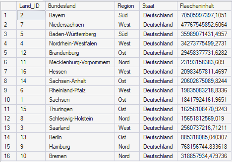

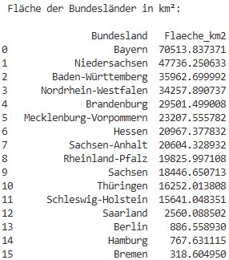

Die Gegenüberstellung der berechneten Flächenwerte zeigt, dass sämtliche
Bundesländer innerhalb der definierten Toleranz liegen. Die maximal beobachtete
relative Abweichung liegt deutlich unterhalb von 0,5 % und tritt insbesondere
bei kleineren Flächen auf. Abweichungen, die über die erwarteten numerischen
Unterschiede hinausgehen, konnten nicht festgestellt werden.

Damit ist nachgewiesen, dass die Zielumgebung SQLite/SpatiaLite in der Lage ist,
räumliche Flächenberechnungen fachlich korrekt und mit ausreichender numerischer
Genauigkeit durchzuführen.

Der Testfall **T12 – Räumliche Berechnung: Flächenberechnung von
Bundesländern** gilt somit als erfolgreich durchgeführt.

#### T13 – Räumliche Berechnung: Referenzpunkt und Distanzberechnung

Ziel dieses Testfalls ist die Überprüfung, ob die Zielumgebung (SQLite in
Kombination mit SpatiaLite und Python) in der Lage ist, eine vollständige
räumliche Verarbeitungskette umzusetzen. Im Mittelpunkt steht dabei nicht
ausschließlich die Distanzberechnung, sondern die korrekte Erzeugung eines
Referenzpunkts, dessen Einbindung in das bestehende räumliche Datenmodell sowie
die darauf aufbauende Berechnung von Distanzen.

Der Testfall adressiert die funktionalen Anforderungen **FD3 (Räumliche
Berechnungen)** sowie **FP3 (Ausführung von SQL-Anweisungen)**.

Aufbauend auf den vorherigen Testfällen **T10** (Darstellung von
Flächengeometrien), **T11** (räumliche Selektion) und **T12**
(Flächenberechnung) wird in diesem Testfall geprüft, ob die Zielumgebung auch
punktbasierte räumliche Operationen korrekt durchführen kann.

Als fachliche Referenz dient die Lösung einer Übungsaufgabe aus dem Modul
*Datenbankentechnologien* (*MS SQL 2 – Verwaltung geografischer Informationen*),
in der ein fester Referenzpunkt (HTW Dresden) als Geometrie erzeugt und die
Entfernung aller Shops zu diesem Punkt berechnet wird. Die Ergebnisse dieser
Berechnung in Microsoft SQL Server (MS SSMS) bilden den Maßstab für die
Validierung der Zielumgebung.

In der Zielumgebung wird der Referenzpunkt aus seinen geografischen Koordinaten
(Längen- und Breitengrad) mithilfe der Funktion `MakePoint()` als
Punktgeometrie im Koordinatenreferenzsystem EPSG:4326 erzeugt. Um eine
Distanzberechnung in Metern zu ermöglichen, werden sowohl die Shop-Koordinaten
als auch der Referenzpunkt vor der Berechnung in das metrische
Koordinatenreferenzsystem ETRS89 / UTM Zone 32N (EPSG:25832) transformiert. Die
Distanzberechnung erfolgt anschließend mit `ST_Distance()` auf den projizierten
Punktgeometrien.

Verglichen werden die Resultsets der Referenz- und Zielumgebung mit dem Ziel,
sicherzustellen, dass die berechneten Distanzen fachlich übereinstimmen.

Für den Vergleich gelten folgende Kriterien:

- identische Anzahl der berechneten Distanzwerte,
- eindeutige Zuordnung der Distanzwerte zu identischen Shops,
- Übereinstimmung der berechneten Distanzen innerhalb einer definierten
  relativen Toleranz.

Da die Referenzumgebung eine geodätische Distanzberechnung auf dem Ellipsoid
verwendet, während die Zielumgebung eine Distanzberechnung auf projizierten
Koordinaten durchführt, ist mit geringfügigen numerischen Abweichungen zu
rechnen. Der Vergleich erfolgt daher nicht auf exakte Gleichheit. Stattdessen
wird eine relative Toleranz von **0,5 %** festgelegt. Ein Distanzwert gilt als übereinstimmend, wenn die relative Abweichung den
Toleranzwert von 0,5 % nicht überschreitet.

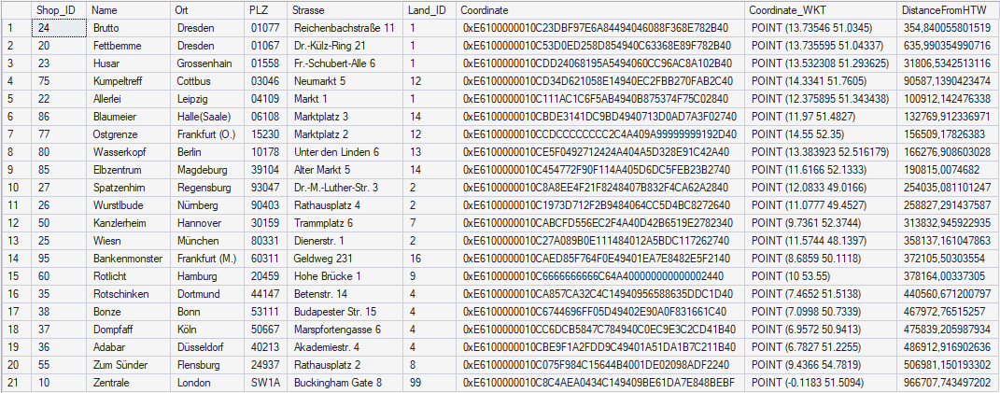

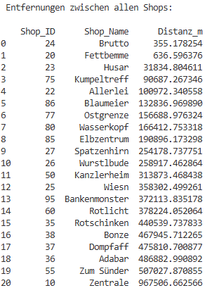

Die Gegenüberstellung der berechneten Distanzen zeigt, dass sämtliche
Shop-Distanzen innerhalb der definierten Toleranz liegen. Die maximal
beobachtete relative Abweichung liegt deutlich unterhalb des festgelegten
Grenzwerts und ist insbesondere bei größeren Entfernungen geringfügig höher,
was den erwarteten numerischen Unterschieden zwischen geodätischer und
projizierter Berechnung entspricht. Fachlich relevante Abweichungen konnten
nicht festgestellt werden.

Damit ist nachgewiesen, dass die Zielumgebung SQLite/SpatiaLite in der Lage ist,
einen externen Referenzpunkt korrekt als Geometrie zu erzeugen, räumlich in das
bestehende Datenmodell einzubinden und darauf aufbauend Distanzberechnungen
fachlich korrekt und mit ausreichender numerischer Genauigkeit
durchzuführen.

Der Testfall **T13 – Räumliche Berechnung: Referenzpunkt und
Distanzberechnung** gilt somit als erfolgreich durchgeführt.

---
<div style="display: flex; justify-content: space-between;">
  <a href="72_Testfälle.md">◀ 7.2 Testfälle</a>
  <a href="8_Ergebnisauswertung.md">8 Ergebnisauswertung
 ▶</a>
</div>